<section markdown="1" id="project-plan">
## Project Plan

<figure markdown="1" class="full-width">

Owner | Due Date | Status | Task | Comments
------|----------|--------|------|---------
      |          |        | Install the enterprise-side HCX manager. |
      |          |        | Configure enterprise-side HCX manager. | May require special configuration for Direct Connect.
      |          |        | Configure Multi-Site Service Mesh. |

<button onclick="exportCSV('hcx-installation')" style="float:right;">Export</button>
</figure>

</section>

<section markdown="1" id="install-the-ent-hcx-mgr">
## Install the Enterprise HCX Manager

The enterprise-side HCX manager appliance is downloaded via a download link provided by the cloud-side manager. Once downloaded, it should be deployed from the enterprise-side vCenter server which manages the workloads targeted for migration.

This appliance will require an IP address for network connectivity, and will ideally be connected to the "management" network of the vSphere environment. Take note of the IP address which you assigned to this appliance, as well as the admin and root user passwords which you set during the deployment. Also, be sure to provide DNS and NTP settings for the appliance.

Once the appliance has deployed, it may be accessed via HTTPS on its assigned IP using port 9443. Note that it may take up to 10 minutes before first-boot scripts finish executing and services are started. Login as the admin user and provide the password set during appliance deployment.

<figure>
  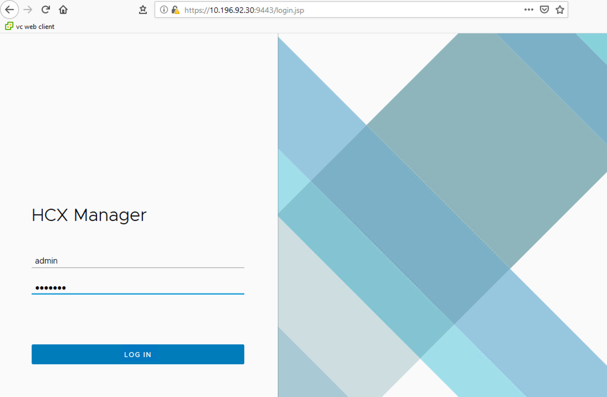
</figure>

Upon the first login, you will need to provide some initial configuration for the HCX manager. The first step is to provide the rough physical location of your datacenter (this is used to provide map illustrations within HCX).

<figure>
  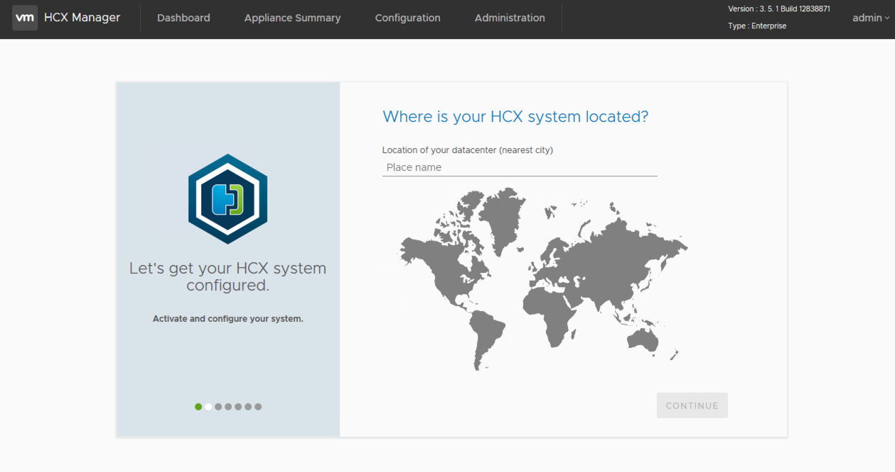
</figure>

Next, you must activate HCX by providing the activation key which was generated within the VMC console. Continue with the setup when prompted.

<figure>
  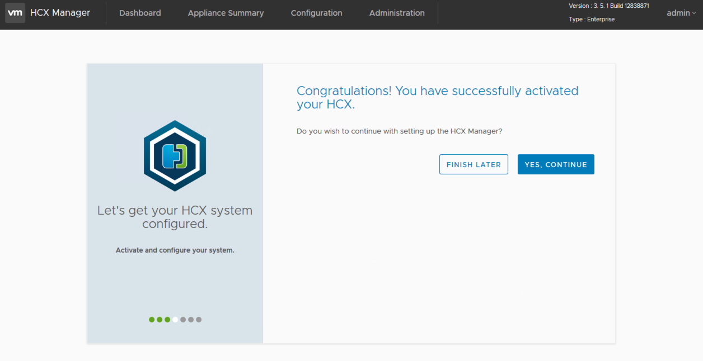
</figure>

HCX will need to connect to the local vCenter Server...

<figure>
  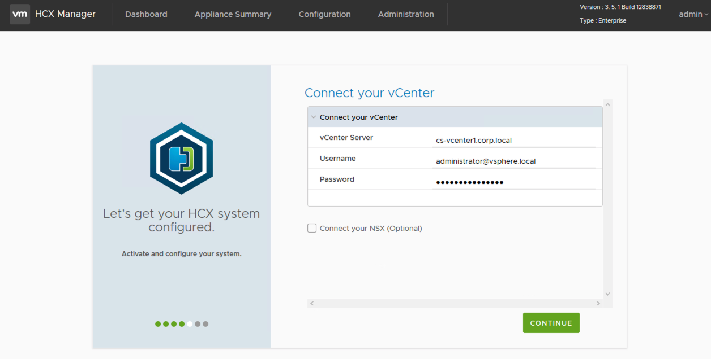
</figure>

...and to the SSO/PSC appliance.

<figure>
  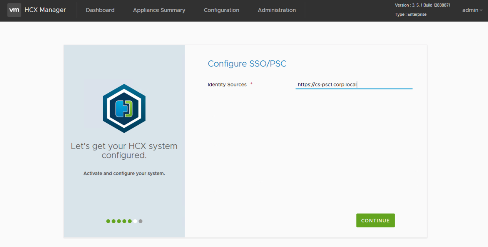
</figure>

Finally, a restart is required.

<figure>
  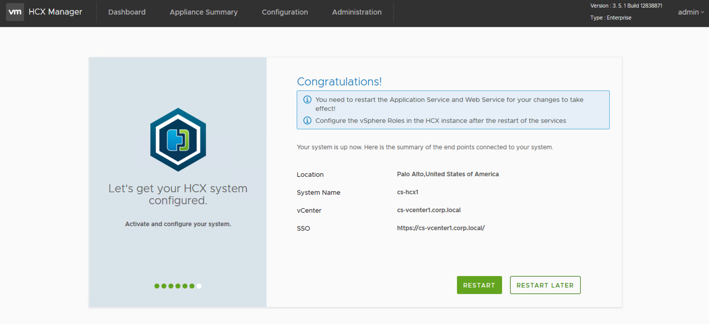
</figure>

</section>

<section markdown="1" id="config-the-ent-hcx-mgr">
## Configure the Enterprise HCX Manager

<section markdown="1" id="role-mapping">
### Role Mapping
After installation and initial setup, the HCX manager will be rebooted. It may take several minutes for services to restart.

Once the manager has finished restarting, login and configure vSphere role mapping. Role mapping is necessary in order to define which vSphere users may access the HCX UI components.

<figure>
  
</figure>

You should now log out of vCenter and log back in. Once you have logged back in, then you should see the HCX UI component installed within the vCenter web client.

<figure>
  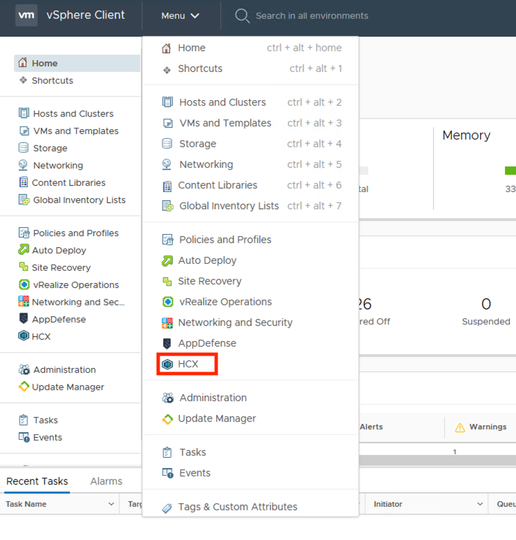
</figure>

</section>

<section markdown="1" id="dns-for-dx">
### DNS Resolution for Direct Connect
For users who wish to utilize Direct Connect Private VIF for HCX traffic, there is an additional required step.

Since the enterprise-side HCX manager must communicate with the cloud-side manager, and this communication will be via the enterprise-side manager connecting to the FQDN of the cloud-side manager, the enterprise-side manager must be able to resolve the cloud-side FQDN to a private IP. Currently, there is no means to change this resolution within the SDDC itself, so the change must be made locally on the enterprise-side manager. To do this, you must edit the /etc/hosts file of the enterprise-side manager.

Connect via ssh to the enterprise-side manager and login as admin. Sudo to root and edit the /etc/hosts file.

<figure>
  
</figure>

You must create an entry for the FQDN of the cloud-side manager. The private IP of the cloud-side manager is visible either from the SDDC vCenter server or from the group definition for the HCX manager in the management gateway firewall rule in the Network and Security section of the SDDC.

<figure>
  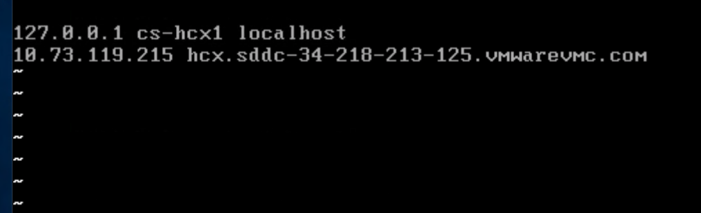
</figure>

Once this step is completed, the enterprise-side manager may utilize the Direct Connect when connecting to the cloud-side manager.

Since the enterprise-side HCX manager is connecting via its private IP, you may need to adjust the MGW gateway firewall rules in the SDDC to permit the connectivity.

</section>

</section>

<section markdown="1" id="config-service-mesh">
## Configuring the Multi-Site Service Mesh
Login to vCenter and navigate to the HCX dashboard. 

<figure>
  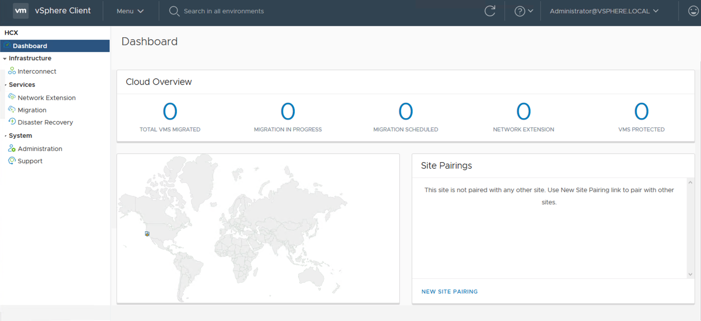
</figure>

<section markdown="1" id="create-cmpt-prof">
### Create a Compute Profile
Navigate to the Interconnect screen and click on the Multi-Site Service Mesh tab. The first step will be to create a Compute Profile.

<figure>
  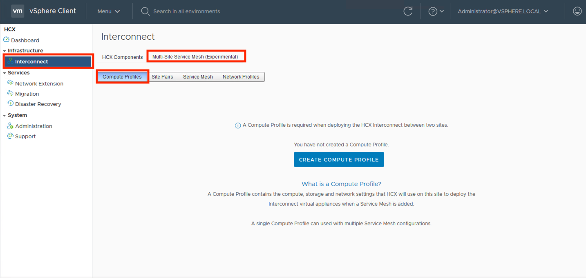
</figure>

Provide a name for your profile.

<figure>
  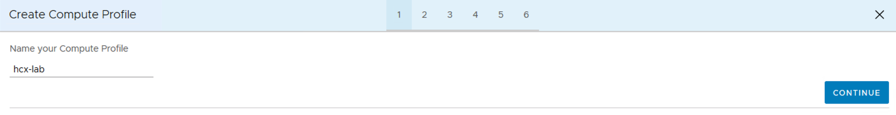
</figure>

Select the HCX services you wish to activate.

<figure>
  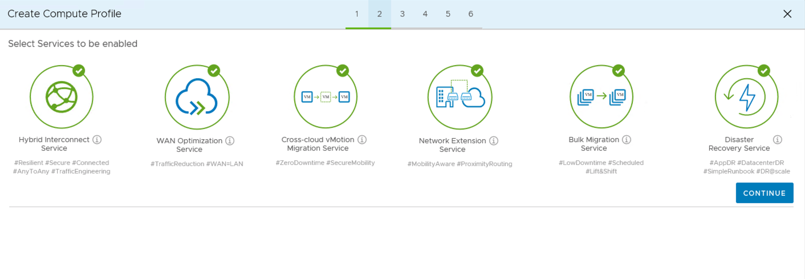
</figure>

Select the target cluster for the additional HCX appliances.

<figure>
  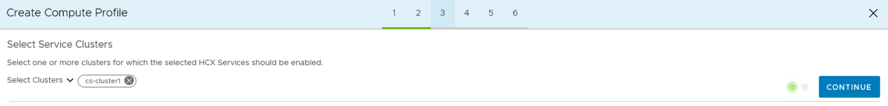
</figure>

Select the target datastore for the additional HCX appliances.

<figure>
  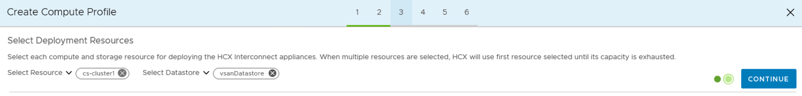
</figure>

Create a Network Profile. This will be used for determining network interfaces and IP addresses for the additional HCX appliances.

<figure>
  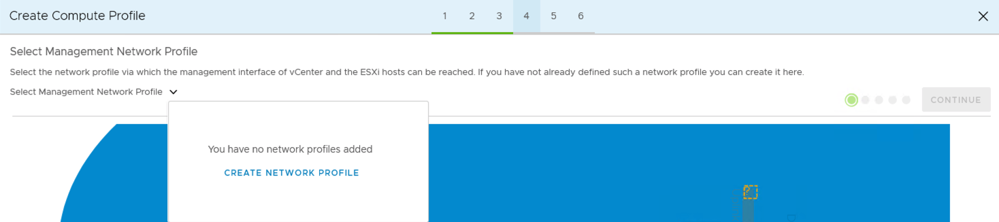
</figure>

In this example, a single network (the vSphere management network) will be used for all connectivity. If your setup will utilize multiple networks, then at least 1 of them must provide a default gateway and DNS settings. You must also provide a pool of usable addresses for HCX appliances. In this example setup we will only use a single IX and Network Extension appliance, so will only require 2 addresses.

<figure>
  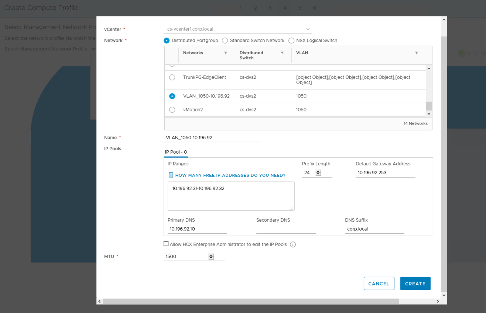
</figure>

Once Network Profiles have been created, we may use them within the Compute Profile. In this example, we will use the same profile in multiple places.

Firstly, specify the profile for the management network...

<figure>
  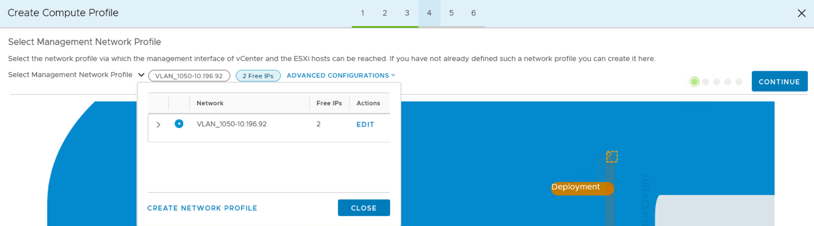
</figure>

...then the uplink network (the network with access to the internet or Direct Connect)...

<figure>
  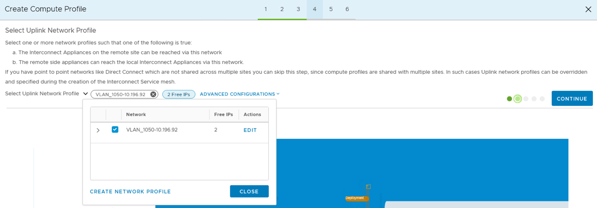
</figure>

...and the vMotion network...

<figure>
  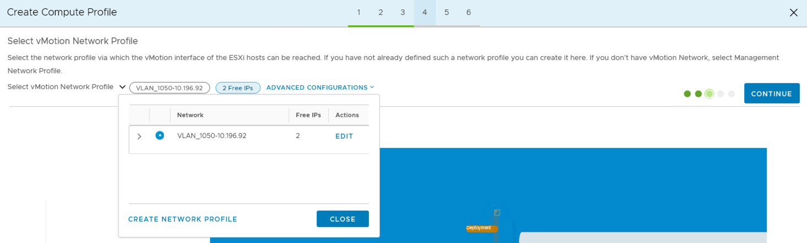
</figure>

...and the vSphere Replication network.

<figure>
  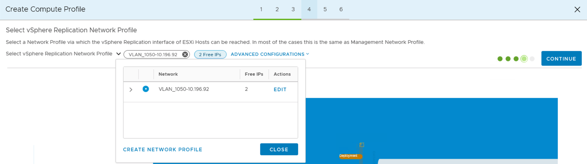
</figure>

Since we have chosen to utilize the network extension services for this example, we must specify the vDS which contains networks to be extended. Remember, that there will be one Network Extension appliance required per vDS.

<figure>
  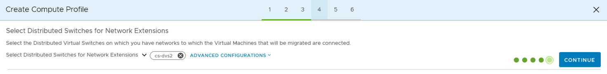
</figure>

HCX will provide you with a reminder that it requires certain connectivity over both the WAN and between components in the LAN.

<figure>
  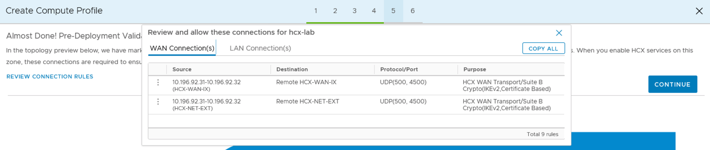
</figure>

Finish the Compute Profile definition.

<figure>
  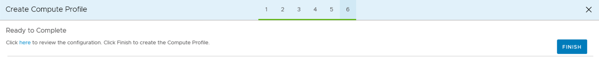
</figure>

</section>

<section markdown="1" id="create-site-pair">
### Create a Site Pair
Define a site pairing for the SDDC.

<figure>
  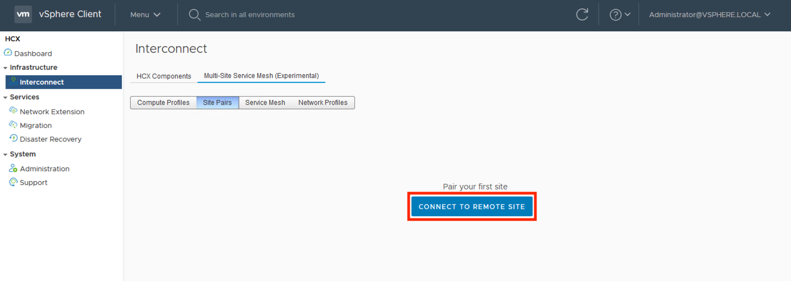
</figure>

Specify the FQDN of the cloud-side HCX manager and the credentials for the SDDC cloudadmin user.

<figure>
  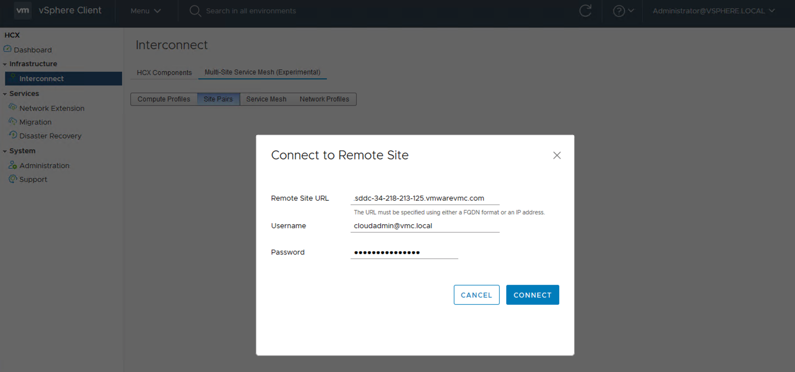
</figure>

HCX will verify connectivity and create the site pair.

<figure>
  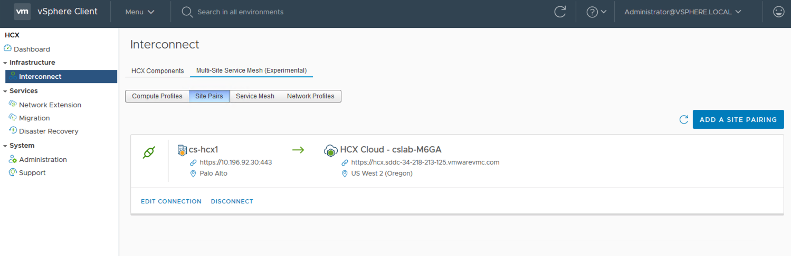
</figure>

</section>

<section markdown="1" id="create-service-mesh">
### Create a Service Mesh

Define a service mesh using the previously created Compute and Network profiles, and the site pairing.

<figure>
  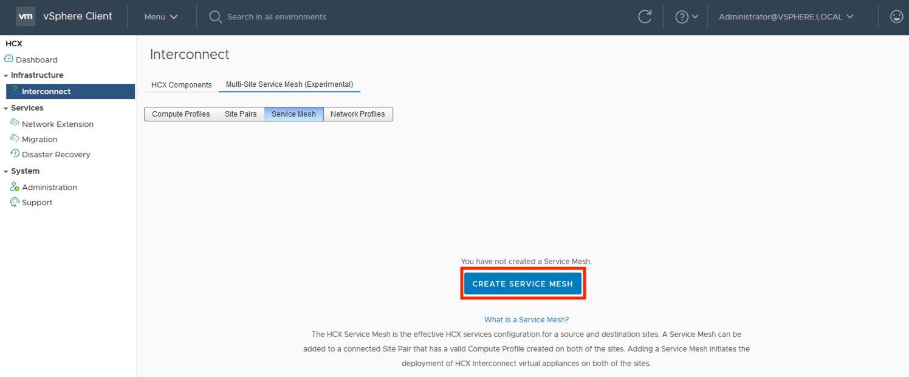
</figure>

Provide the site pairing.

<figure>
  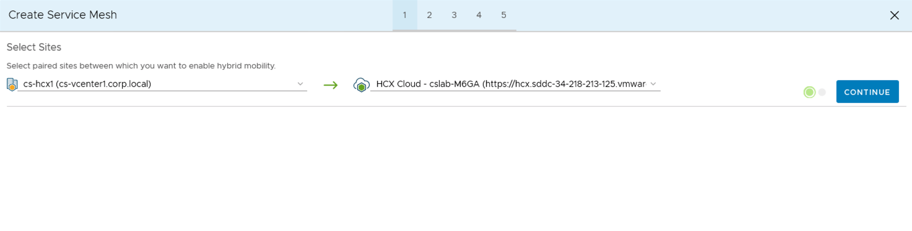
</figure>

Specify the Compute Profile which you defined and the Compute Profile of the SDDC (which was automatically created by the cloud-side manager).

<figure>
  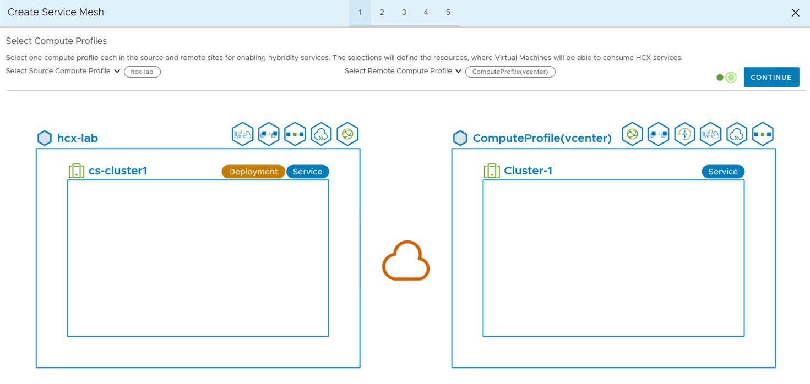
</figure>

Verify the services you want to support. In this example the Disaster Recovery services is deselected.

<figure>
  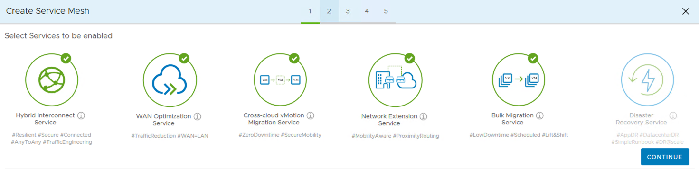
</figure>

Define the Network Profiles to use. You should use the one associated with the Compute Profile which was created. For the cloud-side, use a profile for the network path you wish to use toward the SDDC. In this example, we are using the profile associated with the Direct Connect.

<figure>
  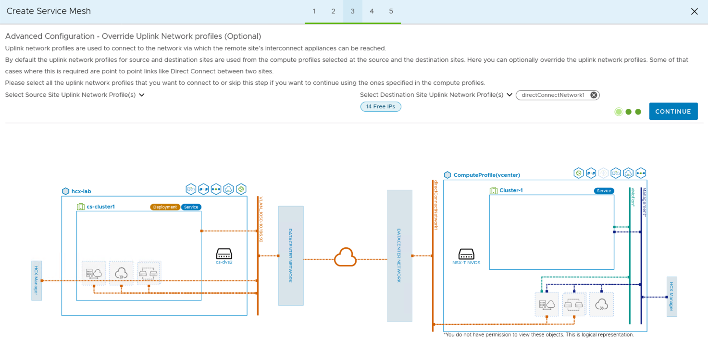
</figure>

Optionally, define the number of additional Network Extension appliances you wish to support.

<figure>
  
</figure>

Provide the bandwidth cap for the WAN-Opt appliance.

<figure>
  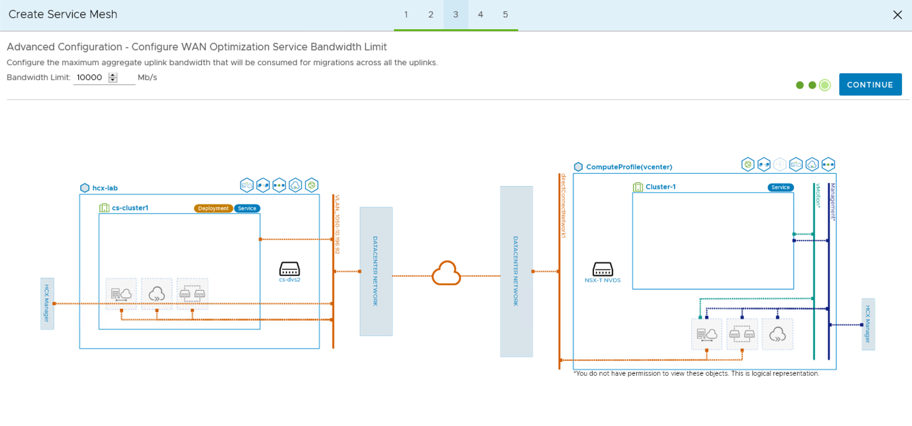
</figure>

Name the Service Mesh and finish.

<figure>
  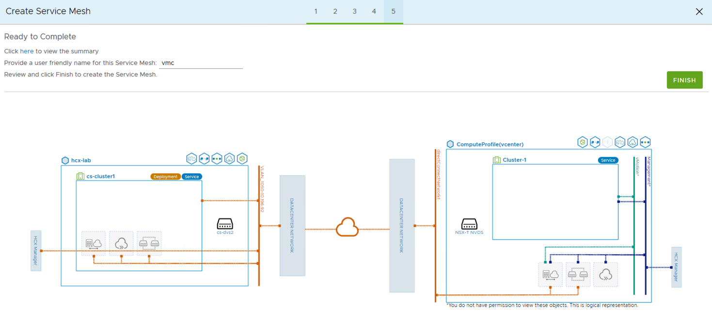
</figure>

You can monitor the deployment of the additional HCX appliances. The tunnels for the IX and Network Extension appliances should come up once these appliances have finished deploying, booting, and have started services.

<figure>
  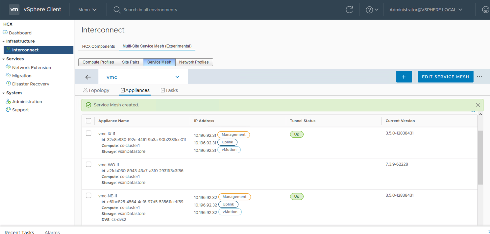
</figure>

</section>

</section>

