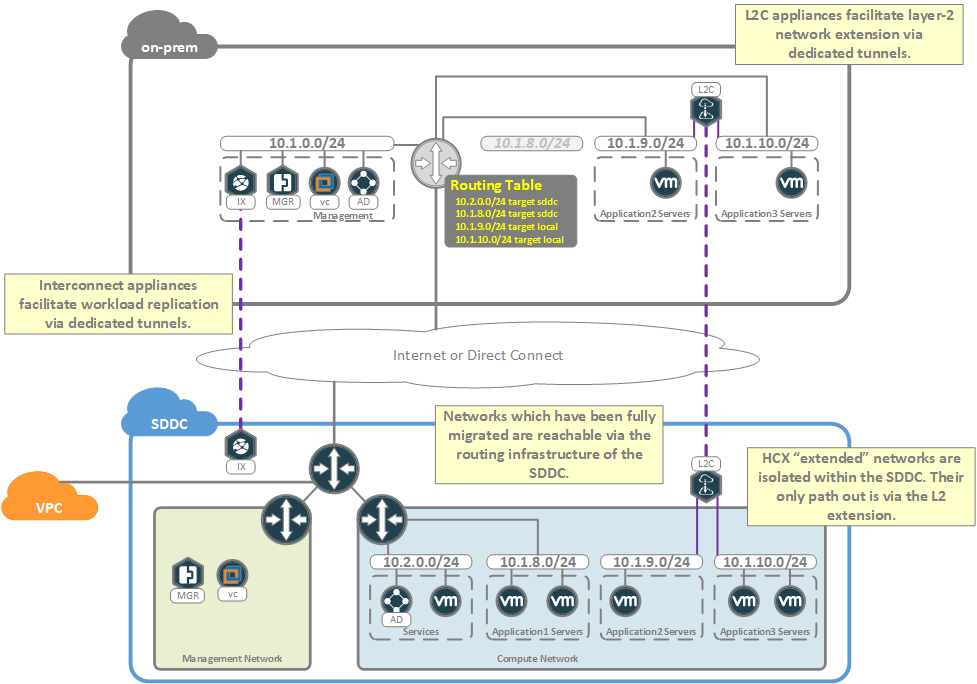

<section markdown="1" id="introduction-to-hcx">
## Introduction to HCX

<section markdown="1" id="what-is-hcx">
### What is HCX?
Although [HCX]({{ site.data.links.vmw.hcx.url }}) provides a number of technical features, its core function lies within its ability to transparently migrate workloads between vSphere environments. While the concept of "workload migration" as a core function seems rather simplistic, the services provided by HCX enable a number of business cases which are otherwise highly impractical.

Specifically, HCX addresses the following technical problems which have previously made these business cases unworkable:
* Migration from older versions of vSphere to modern versions of vSphere
* Migrations from non-VMware environments to vSphere
* Migration without the need for IP address changes
* Migration which utilize WAN optimization and data de-duplication
* Data security in the form of [NSA Suite B](https://en.wikipedia.org/wiki/NSA_Suite_B_Cryptography) cryptography for migration traffic

This guide will focus on HCX as applied to [VMware Cloud on AWS]({{ site.data.links.vmw.vmcaws.url }}) and is intended to provide supplemental documentation to the [official HCX user guide]({{ site.data.links.vmw.hcx_doc.url }}).
</section>

<section markdown="1" id="when-to-use-hcx">
### When to Use HCX
The decision of when and if to use HCX should be driven by some "trigger" event in which a specific business need may best be delivered by the functionality which HCX is designed to provide. These triggers are typically broken into 3 categories.

#### Data Center Extension
Data Center Extension business cases are driven by the desire to quickly expand the capacity of an existing data center; either on temporary or permanent basis. Triggers may include:
* Infrastructure update - Driven by the need to perform a refresh of the hardware or software in the existing production environment. Infrastructure updates are commonly driven by organizational changes which prompt "modernization" projects. 
* Capacity expansion - Driven by the need to permanently expand the capacity of a production data center. In this case, HCX provides a means of migrating workloads to and from the SDDC as needed.
* Seasonal bursting - Driven by seasonal expansion. In this case, an SDDC is used to temporarily expand the capacity of a production data center in a transparent manner.

#### Data Center Replacement
Data Center Replacement business cases are driven by the need to evacuate an existing production data center. In these cases, workloads are permanently migrated to one or more SDDCs. Triggers may include:
* Contract renewal - Driven by an expiring contract on a data center.
* Consolidation - Driven by the desire to consolidate 1 or more data centers into a single SDDC (or multiple SDDCs spread across availability zones or regions). Mergers and acquisitions are a common driver for consolidations.
* Vendor replacement - Driven by the desire to migrate a production data center away from an existing service provider.

#### Disaster Recovery
Disaster Recovery business cases are driven by the need to use one or more SDDCs as a disaster recovery site. Triggers may include:
* Compliance - Driven by the need to address disaster recovery in order to meet compliance requirements.
* Availability - Driven by the desire to provide increased availability to an existing data center or another SDDC.
* Replacement - Similar to the Data Center Replacement case, but specific to replacing a DR site.

</section>

<section markdown="1" id="how-to-use-hcx">
### How to Use HCX
Projects involving HCX should roughly follow the process below. 
1. Planning - Determine the target SDDC for workload migration and plan migration "waves" based around how easily/quickly workloads may be migrated (always migrating in order of easiest to most difficult).
2. Preparation - Prepare for enterprise-side HCX installation, and perform minimal networking (e.g. VPN, Direct Connect, etc...) and firewall configurations required to prepare the SDDC for the migration.
3. Installation - Activate cloud-side HCX and install enterprise-side components.
4. Testing - Ensure that HCX is working as expected and gather baseline performance metrics.
5. Migration - Migrate workloads based on pre-established wave planning.
6. Network cutover (optional) - Cut over any networks which are to become native within the SDDC.

Each step in this process will be described in detail within this document.
</section>

</section>

<section markdown="1" id="technical-overview">
## Technical Overview

<section markdown="1" id="hcx-components">
### HCX Components
HCX requires that a number of appliance be installed; both within the SDDC and within the enterprise environment. These appliances are always deployed in pairs, with one component on the enterprise side and a twin within the SDDC. Installation is driven from the enterprise environment and results in appliances being deployed both within the enterprise and the cloud.

HCX uses the following appliances:
* Manager - This component provides management functionality to HCX. Within the SDDC, this component is installed automatically as soon as HCX is activated. A download link will be provided for the enterprise HCX manager appliance from within the cloud-side manager. This appliance will be manually installed and will be used to deploy all other components and to drive the operations of HCX.

* WAN Interconnect Appliance (IX) - This component facilitates workload replication and migration. The appliance will establish its own dedicated IPSec tunnels for communication to its peer within the SDDC.

* WAN Optimization Appliance (WAN-Opt) - This component provides WAN optimization and data de-duplication for the WAN Interconnect Appliance. It communicates exclusively with the WAN Interconnect Appliance via private IP (uses addresses from IPv4 range reserved for carrier grade NAT).

* Network Extension (L2C) - This component provides [Layer-2](https://en.wikipedia.org/wiki/Data_link_layer) network extension for the purposes of "extending" networks between vSphere environments. It will establish its own dedicated IPSec tunnels for communication to its peer within the SDDC.

* Proxy Host - This is a fake ESXi host which is deployed silently by the WAN Interconnect appliance. This host is used to as the target for vmotion/migrations and is used to "trick" vCenter into thinking the migration target host is local. This host will be visible in the inventory of vCenter.

</section>

<section markdown="1" id="multi-site-service-mesh">
### Multi-Site Service Mesh 
The Multi-Site Service Mesh feature represents a major change to how HCX is deployed and managed. In the previous model, HCX used an appliance-based view of the world where appliances were deployed based on the HCX function which was needed. In the new model, HCX takes a service-based view where the user picks the services they need and HCX deploys the appliances required to deliver those services.

All planned new functionality with HCX will be based on Multi-Site Service Mesh, so it is the recommended deployment mechanism for all new installations. If you are a current user of HCX and wish to utilize the service mesh, then you may upgrade your deployment to utilize Multi-Site Service Mesh. Note that you must not have any migrations in progress or networks extended in order to upgrade to Multi-Site Service Mesh.
</section>

<section markdown="1" id="workload-migration-overview">
### An Overview of Workload Migration
Let's walk through a typical example of a workload migration project using the following diagram. We will operate under the assumption that proper wave planning and testing have already been performed.

<figure>
  
  <figcaption>Workload Migration</figcaption>
</figure>

In this example, HCX is being used to migrate application workloads and their associated networks to the SDDC. As indicated, the WAN Interconnect appliance (IX) is responsible for data replication between the enterprise environment and the SDDC. This replication traffic is carried over a dedicated IPSec tunnel which is initiated by the enterprise appliance and is optimized using the WAN Optimization appliance (not shown). The Network Extension appliance (L2C) is responsible for creating a forwarding path for networks which have been extended to the SDDC. Again, this traffic is carried over a dedicated IPSec tunnel which is initiated by the enterprise appliance.

Within the SDDC exists a "Services" network which contains critical services such as DNS or Active Directory which are designed to serve the local environment. In general, it is a good idea to keep such services as close to the consumers (SDDC workloads in this case) as possible. Doing so will not only cut down on network traffic sent to the WAN, but will also reduce dependencies between sites.

We can see from the diagram that a migration is in progress. In this scenario, we are migrating all of the application servers located in the networks 10.1.8.0/24, 10.1.9.0/24, and 10.1.10.0/24. The network 10.1.8.0/24 has already been completely migrated and, as a result, the L2 extension has been disconnected and the enterprise version of the network has been shut down. This network is now accessible directly through the routing infrastructure of the SDDC. This process of making the SDDC the authority for a migrated network is often referred to as a "network cutover".

Workloads from within the networks 10.1.9.0/24 and 10.1.10.0/24 are still in the process of being migrated. As indicated, the L2C is attached to these networks such that it is providing a layer-2 network extension to the SDDC. Due to this network extension, the workloads which have already been migrated have been able to retain their network addresses and, from a routing perspective, appear to reside within the enterprise environment. These "extended" networks are not tied into the routing infrastructure of the SDDC. 

Extended networks present an interesting routing scenario. Due to the fact that they are not tied to the routing infrastructure of the SDDC, the only "way out" for the workloads is via the layer-2 network extension to the enterprise default-gateway. This means that all traffic which is "non-local" to the extended network must pass through the L2C and be routed through the enterprise gateway router. This includes not only communications to resources within the enterprise environment, but also to communications between other extended networks, as well as to networks which are native to the SDDC or to resources within the cross-linked VPC.

This process of forwarding traffic from SDDC -> enterprise -> SDDC between extended networks is referred to as "tromboning", and can result in unexpected WAN utilization and added latency. Since migrations tend to be a temporary activity, this tromboning effect is not typically a major concern. However, it is important to keep in mind when planning migrations such that it may be reduced as much as possible. For layer-2 extensions that are intended to exist in a more permanent fashion, HCX provides a feature by the name of Proximity Routing, which is designed to eliminate the tromboning effect. This feature is not currently supported in VMware Cloud deployments but is currently planned as a roadmap item.

</section>

<section markdown="1" id="dr-overview">
### An Overview of Disaster Recovery
HCX Disaster Recovery replicates and protects Virtual Machines using an SDDC as the recovery site, and provides flexible configuration of recovery point objectives (RPO) for workloads in intervals from 5 minutes to 24 hours. As an HCX feature, it can take advantage of WAN optimization and de-duplication for replication traffic and can utilize network extension as a means of recovering workloads without requiring IP address changes.

Consider the following illustration.

<figure>
  
  <figcaption>Disaster Recovery</figcaption>
</figure>

In the above scenario, the application servers are being protected by Disaster Recovery using two separate methods. 

Servers in the subnet 10.1.8.0/24 are not required to keep their IP addresses upon recovery, so are being recovered to the 10.2.8.0/24 network which is native to the SDDC. In the event of a failure at the active site, these workloads will be recovered in the SDDC and DHCP will be used to re-assign their IP addresses.

Servers in the subnet 10.1.9.0/24 are operating under a different constraint, and cannot tolerate a change of IP addressing. In this situation, network extension is used to ensure that workloads recovered within the SDDC will not require an IP address change upon recovery.

As a general rule, it is a good practice to maintain a local version of critical services (such as DNS or active directory) which can serve workloads within the SDDC. In this case, servers in the 10.2.8.0/24 subnet would utilize local services in the event of a recovery to the SDDC.

</section>

</section>
