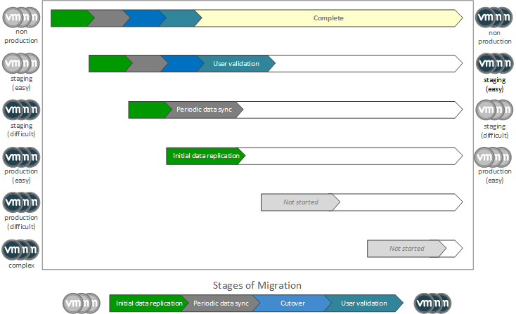

<section markdown="1" id="project-plan">
## Project Plan

<figure markdown="1" class="full-width">

Owner | Due Date | Status | Task | Comments
------|----------|--------|------|---------
      |          |        | Identify target completion date for migration project. |
      |          |        | Gather requirements needed for target site selection. | 
      |          |        | Select a target site and deploy the SDDC. | See associated documentation on VMware Cloud on AWS.
      |          |        | Gather list of required services for the target site. Determine a plan for providing these services. | 
      |          |        | Identify strategy for network connectivity to the target site.  | See associated documentation on VMware Cloud on AWS.
      |          |        | Identify workloads which will be migrated. | 
      |          |        | Identify networks which will be migrated to the target SDDC. | These are networks used by migrated workloads which will be moved to the SDDC.
      |          |        | Identify "anchor" workloads which are attached to networks which will be migrated. | Anchor workloads, such as hardware appliances, are those which cannot be migrated.
      |          |        | Develop a migration plan to include workload migration waves and migration time estimates. |
      |          |        | Develop a post-migration validation plan. |
      |          |        | Develop a backout plan for the migration. |

<button onclick="exportCSV('hcx-planning')" style="float:right;">Export</button>
</figure>

</section>

<section markdown="1" id="site-selection">
## Site Selection
Site selection is the process of determining the target region for migrated workloads. When selecting a region, consider the following:
- Latency - How far away, in terms of network latency, is the target region from the main user base?
- Bandwidth - How much available bandwidth is there to the target region? Are high-speed private lines (e.g. Direct Connect) available?
- Geography - Are there any geographic requirements to consider? For example, must the target site be physically separate from other sites for fault tolerance?
- Locality - Are the migrated workloads required to stay within the legal jurisdiction of a certain country/state/county?
- Economics - Are certain regions more costly than others?
- Capacity - Is there sufficient capacity (current and future) to support the migrated workloads?

</section>

<section markdown="1" id="network-and-services">
## Networking and Centralized Services
When migrating workloads to a new site it is important to consider how the move might impact the workloads themselves. Consider the following topics.

##### Centralized Services
It is important to note all critical central services which are required by the workloads. Examples would include DNS and Active Directory. You will need to plan on how these services will be made available to the new site. A common practice is to create local copies of the services within the new site, however, it may also be acceptable to utilize a VPN or Direct Connect in order to access services from an on-premises environment.

##### Network Connectivity
A plan for secure, permanent connectivity to the new site is critical. Direct Connect and IPSec VPN are the most common means of enabling this connectivity, however, it is important to consider where these will terminate (i.e. a single on-premises environment or multiple remote sites). It is also important to plan for *minimal* network security on the target site (i.e. NSX gateway firewall policies). 

##### Network Cutover
Workload migration typically involves workloads keeping their original IP addresses. Unless network extension will remain in place permanently, at some point a network cutover (i.e. making a network natively routed on the target site) will be required. Although the details of a cutover plan are not needed prior to beginning migrations, it will ultimately be required to define the exact network changes necessary to accommodate a cutover.

</section>

<section markdown="1" id="migration-planning">
## Migration Planning

<section markdown="1" id="wave-planning-process">
### The Wave Planning Process

Wave planning is the process of determining which workloads will be migrated, and in what order. This process allows for workloads to be methodically migrated in groups, or "waves", based on a strategy which is the most likely to result in a successful migration with minimal impact to production.

One technique for wave planning is to categorize workloads based on how easy they are to migrate and how critical they are to production.

<figure>
  
  <figcaption>Migration Waves</figcaption>
</figure>

This method of categorization is based on the notion of always starting with the easiest and least critical workloads first, and saving more difficult and more critical workloads for last. Waves may then be staggered such that as one wave completes its initial data replication, the next wave is being queued up.

Common examples of workload categorization are as follows:
* Non-Production - This may include workloads used for testing or development.
* Staging (easy) - Staging servers which are pre-production and have no external dependencies.
* Staging (difficult) - Staging servers which are pre-production, but have complex external dependencies such as external load-balancers or firewalls.
* Production (easy) - Production servers which have few or no external dependencies.
* Production (difficult) - Production which have complex external dependencies, are large, or may not incur any downtime.
* Complex - Complex production servers including non-virtual workloads which must be virtualized, large or write-heavy databases, or workloads with multi-writer VMDK or Raw Device Mapping (RDM).
* No-Migrate - These are workloads which cannot be migrated. Examples would include hardware appliances or non-x86 workloads, workloads with SRIOV, workloads with incompatible hardware versions, or workloads running on unsupported versions of ESXi or vCenter. These workloads are referred to as "anchors".

</section>

<section markdown="1" id="hcx-migration-techniques">
### HCX Migration Techniques

When performing wave planning, it is important to keep in mind the migration technique which is the most optimal for a given workload or group of workloads.

#### HCX Cold Migration
This technique is used for VMs which are in a powered-off state. Workloads which may typically be cold migrated are testing and development VMs, or templates. A very small percentage of workloads tend to use this migration technique.

#### HCX Bulk Migration
The vast majority of workloads will use this technique. Bulk migration is also commonly referred to as "reboot to cloud" since workloads are first replicated, and at a pre-defined time are "hot swapped", meaning that the original workload is powered off and archived at the same time that its replica in the cloud is powered on.

Bulk migration utilizes a scheduler to execute the actual migration. The process for scheduling a migration is as follows:
1. Identify a migration wave and schedule the migration.
2. HCX begins the initial data replication between sites via the IX appliance, and utilizes the WAN-Opt appliance for WAN optimization and data de-duplication.
3. Once the initial data replication has completed, HCX will continue to replicate changes periodically.
4. When the scheduled migration time arrives, HCX will begin the cutover process.

The cutover process for bulk migration is as follows:
1. Power down the source workload. 1 - 10 minutes depending on VM shutdown time.
2. Perform final data sync. 1 - 10 minutes.
3. Optional pre-boot fixups (e.g. hardware version upgrade). 1 - 2 minutes depending on vCenter load.
4. Boot on target. 10 - 20 minutes depending on vCenter load.
5. Optional post-boot fixups (e.g. vmtools upgrade). 1 - 10 minutes.
6. User validation of workload. 0 - n minutes depending on user requirements for validation.

#### HCX vMotion
This technique is reserved for workloads which cannot tolerate a reboot. Given that additional state must be replicated at the time of the migration, it is more resource intensive than a bulk migration. Typically, only a small percentage of workloads will require vMotion.

There are 2 options for vMotion: standard vMotion and Replication Assisted vMotion (RAV). With standard vMotion, you are limited to a single migration at a time. Originally, this was the only option for vMotion. With the introduction of RAV, vMotion was given a few of the features of bulk migration; specifically the ability to migrate multiple workloads in parallel, the ability to utilize the WAN-Opt appliance for optimization and de-duplication, and the ability to utilize the scheduler.

##### Restrictions for vMotion
The following are summarized from the HCX user guide. Please refer to that document for details.
* VMs must be running vm hardware version vmx-09 or higher.
* underlying architecture, regardless of OS, must be x86 on Intel CPUs
* VM disk size cannot exceed 2 TB
* cannot have shared VMDK files
* cannot have any attached virtual media or ISOs
* cannot have change block tracking enabled

**Note**: Only 1 vMotion operation at a time can be running, and it is not recommended to perform migrations using vMotion while bulk migration replication is also in progress.

</section>

<section markdown="1" id="estimating-migration-times">
### Estimating Migration Times
There are a large number of variables to consider when estimating total time required to perform a migration. Some factors which may effect migration times include:
* WAN capacity (in terms of speed/throughput) between the source site and the target site
* Network throughput in the source site LAN
* Storage IOPS at the source and destination sites
* Load (CPU/memory/storage) of individual hosts at the source site
* Ability of WAN-Opt appliance to dedup and compress data
* Rate of change for workloads which are being migrated (i.e. how much delta data sync must regularly take place)
* Load at target site during the cutover phase of a migration (large migration waves will cause more resource contention)
* Time required to perform user validation on migrated workloads

In order to make a reasonable estimate, it is important to understand which variables will represent the largest constraint. For example, if the migration is driven by a data center evacuation where the source site is running on older hardware, then storage or host constraints may easily become the limiting factor. It is also very common that an in-path network appliance is acting as a bottleneck on the source site LAN. There have been many cases where migrations were capped at artificially low rates due to an old in-path firewall or switch/router with a low backplane speed. 

Understanding the complete end-to-end picture of the migration is vital when creating a time estimate. Performing pre-migration testing of the HCX installation will help to provide real-world data for this estimate.
</section>

<section markdown="1" id="wave-planning-tips">
### Wave Planning Tips
The primary goals of wave planning are to facilitate speed, reliability, and minimal production impact. Keep the following in mind when performing wave planning:
* Seek to minimize pre-configuration of the target site. Provide the minimal network and security configurations necessary to enable the migration.
* Seek to minimize changes to workloads. Utilize network extension when possible in order to eliminate the need for IP address changes to workloads.
* Seek to make the migration as transparent as possible. This will help minimize the need to coordinate between application owners, network engineers, and security administrators.
* Seek to minimize resource contention. Migration waves should be limited to 25-50 workloads (with a hard limit of 100) in order to reduce network load during data replication and vCenter load during workload cutover. Overlap waves such that as one wave finishes its initial data replication the next wave is beginning its own. Overlapping in this manner will improve the data de-duplication of subsequent waves. 
* Identify workloads with high rates of disk IO (specifically writes). This indicates a workload which will require large amounts of ongoing data replication. This type of workload should be categorized as "complex" and may need to be migrated in a dedicated wave. Certain workloads, such as large write-intensive databases, may require services to be suspended prior to the migration.

</section>

</section>

<section markdown="1" id="post-migration-test-planning">
## Post-Migration Validation Planning
Post-migration validation provides a means of validating the success of a migration. You will want to develop plans for individual VMs/applications, migration waves, and final network cutover (if applicable). Validation plans should include enough testing to provide confidence in the success of the migration and should include criteria which will trigger a backout of either a specific portion of the migration or of the entire migration.

Validation plans may include the following:
* Tests for individual VMs such as network reachability and performance checks. It may also include validation that all required processes are up and running.
* Application tests to ensure that applications running on migrated VMs are performing as expected.
* Wave checkpoint tests designed to spot-check the target site at the complete of each wave. This will help ensure that overall capacity (CPU/memory/storage) of the target site is in-line with projections.

</section>

<section markdown="1" id="backout-planning">
## Backout Planning
Every good project plan includes backout planning in case something goes critically wrong. The quality of the backout plan will ultimately be determined by the level of testing which is performed prior to the actual migration. It will be critical to understand not only the time required to undo current migrations which may have already been performed, but also the potential impact of VM upgrades made to migrated workloads. 
</section>
