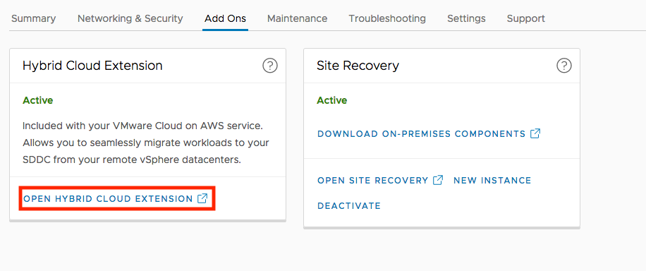
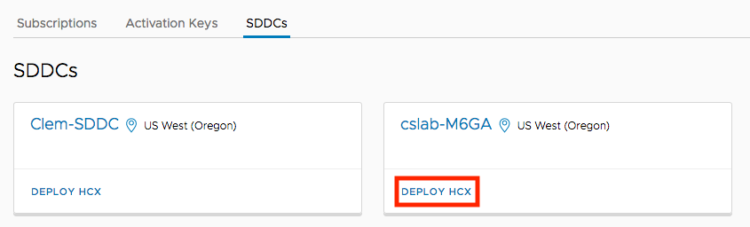
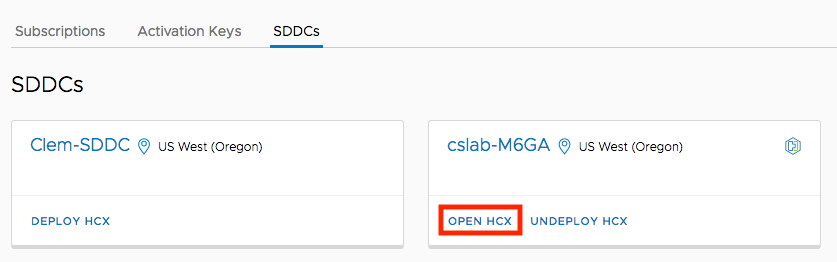
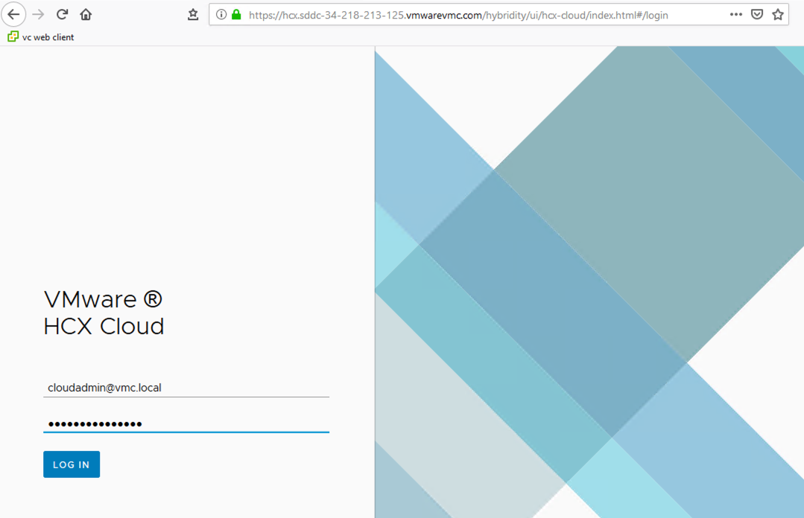
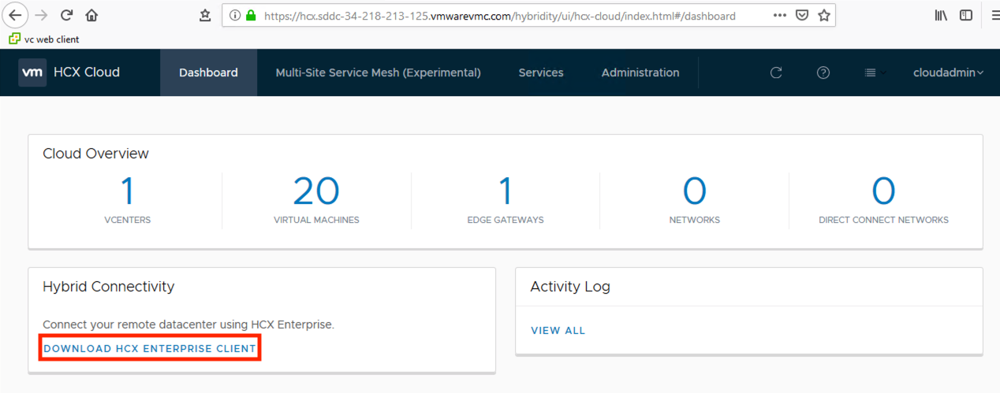
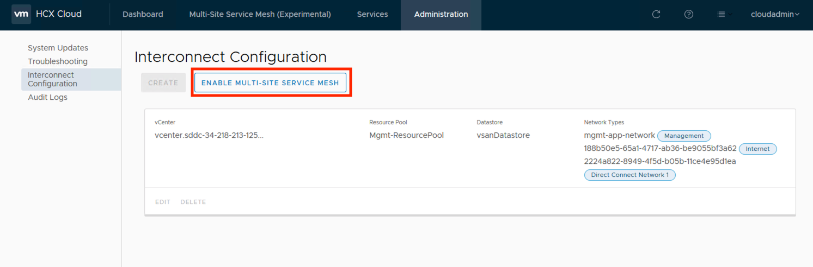
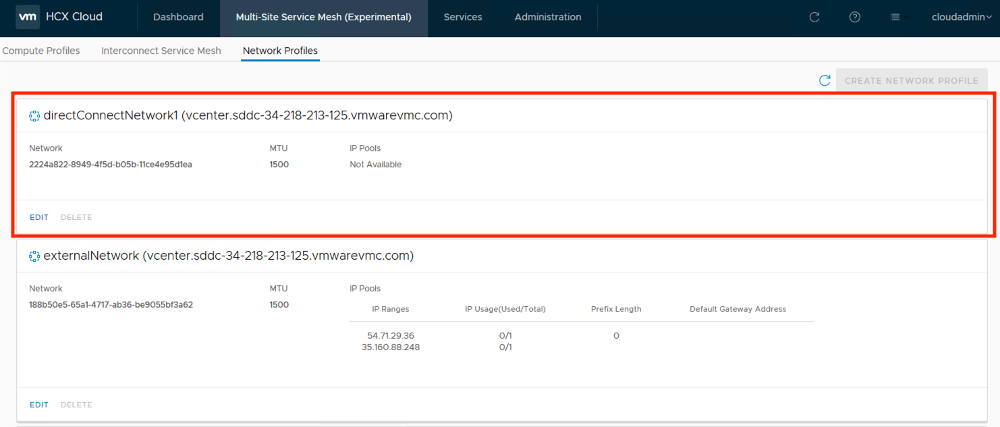

<section markdown="1" id="project-plan">
## Project Plan

<figure markdown="1" class="full-width">

Owner | Due Date | Status | Task | Comments
------|----------|--------|------|---------
      |          |        | Ensure on-premises vCenter and ESX meet minimum version requirements. |
      |          |        | Gather the enterprise vCenter/PSC URL and admin username/password. |
      |          |        | Ensure vDS is available. | Only required if network extension is planned.
      |          |        | Ensure WAN connectivity meets minimum bandwidth requirements for HCX. |
      |          |        | Ensure source network has sufficient resources to install HCX. |
      |          |        | Determine the cluster(s) and datastore(s) to be used for enterprise-side HCX appliances. |
      |          |        | Allocate IP addresses required for enterprise-side HCX appliances. |
      |          |        | Allocate IP addresses for cloud-side HCX appliances for Direct Connect usage. | Only required if Direct Connect is planned.
      |          |        | Activate HCX and (optionally) configure it for Direct Connect support. |
      |          |        | Capture the FQDN and login credentials of the cloud-side HCX manager. |
      |          |        | Generate an activation key for the enterprise-side HCX manager. |
      |          |        | Download the enterprise-side HCX manager. |
      |          |        | Ensure enterprise network security policies permit enterprise HCX appliance connectivity. | Account for access over Direct Connect if applicable.
      |          |        | Ensure that enterprise DNS can resolve central HCX services. |

<button onclick="exportCSV('hcx-preparation')" style="float:right;">Export</button>
</figure>

</section>

<section markdown="1" id="source-site-audit">
## Source Site Audit

<section markdown="1" id="vc-and-esx">
### vCenter and ESXi
HCX requires certain minimal vCenter/ESXi versions per a given migration technique. It is important to audit the infrastructure to ensure that it supports the desired migration.

<figure markdown="1">

Feature                      | Versions
-----------------------------|---------
Bulk Migration               | vCenter 5.1+, ESXi 5.0+
vMotion                      | vCenter 5.5+, ESXi 5.0+
Cold Migration               | vCenter 5.5+, ESXi 5.0+
Replication Assisted vMotion | vCenter 5.5+, ESXi 5.5+
Network Extension            | vCenter 5.1+, ESXi 5.1+
Network Extension (NSX)      | vCenter 5.5+, ESXi 5.5+, NSX-v 6.1+
Disaster Recovery            | vCenter 5.1+, ESXi 5.0+

  <figcaption>vCenter and ESXi Version Requirements</figcaption>
</figure>

The enterprise-side HCX manager will also require access to vCenter. Please make note of the vCenter URL, the PSC URL (if external PSC is used), and the vCenter admin username/password.

</section>

<section markdown="1" id="vds-reqs">
### vSphere Distributed Switch
The network extension service provided by HCX will only support networks which are backed by a [vDS](https://www.vmware.com/products/vsphere/distributed-switch.html). You must ensure that workloads which are to be migrated reside on hosts with an available vDS. If a vDS is not currently utilized, then it may be possible to create one on the host which houses the WAN Extension appliance and use this host as a temporary location for workloads which are being migrated.

**Important Note** - In order to avoid creating layer-2 loops, you may only deploy a single appliance per vDS. Once deployed, the WAN Extension appliance will be able to extend any port-group on the vDS (and by definition, the underlying VLAN of that port-group). It is possible to have separate vCenter/vDS instances which are backed by the same underlying VLAN infrastructure. In this case, it would be possible to deploy a separate WAN Extension appliance to each. This scenario could create a layer-2 loop which can have a serious impact on your on-premise network. 

</section>

<section markdown="1" id="other-network-reqs">
### Other Network Requirements
It is assumed that the enterprise environment has been deployed following VMware recommended practices. A key assumption is that dedicated networks are being used for management, vmotion, etc... HCX cannot extend the management network to the SDDC. If you have workloads which need to be migrated to the SDDC (and use network extension), and these networks reside within the management network, then they must be moved to a non-management network.

HCX needs at least 100Mbps of connectivity to the target SDDC (through the internet or Direct Connect). While it is possible for it to run on less, performance will suffer.

</section>

</section>

<section markdown="1" id="preparing-required-resources">
## Preparing Required Resources

<section markdown="1" id="on-prem-ip-reqs">
### HCX Required Resources
HCX requires that a number of enterprise appliances be installed in the on-premises (source site) environment. It will be required to determine the cluster(s) and datastore(s) which will house the HCX appliances. Please refer to the [official HCX user guide]({{ site.data.links.vmw.hcx_doc.url }}) for CPU, memory, and storage requirements for these appliances.

In most installations, all HCX appliances will use the vCenter management (or similar) network for their connectivity. In this case, each appliance will require only 1 IP. The exception is WAN-Opt appliance, which does not require an address (it relies on IPv4 link-local).

The WAN Interconnect requires connectivity to the vMotion interfaces of ESXi hosts on the enterprise network. If this network is non-routable or otherwise unreachable from the management network, then this appliance will require an additional IP address from the vMotion network. 
</section>

<section markdown="1" id="dx-reqs">
### Direct Connect Private VIF Requirements
HCX can be configured to ride atop Direct Connect Private VIF. In order to do so, it requires that an additional range of private IP addresses be allocated to the cloud-side appliances within the target SDDC. This address range must be unique, routable from the source network, and should be large enough to provide 1 IP for each planned appliance. A small range, such as a /28, is typically sufficient for this. 

Note that this range cannot be taken from the management network of the SDDC. A common practice is to allocate a range from the larger block of address space allocated for the Compute Network of the SDDC.

</section>

</section>

<section markdown="1" id="activate-hcx">
## Activate HCX

<section markdown="1" id="cloud-side-activation">
### Cloud-Side Activation
You should ensure that if you are running an add blocker in your browser that you whitelist connect.hcx.vmware.com.

Installation of HCX within an SDDC is performed from the "Add Ons" tab in the SDDC view of the [VMC Console]({{ site.data.links.vmw.vmc.url }}). Clicking on the "Open Hybrid Cloud Extension" link will take you to the deployment screen.

<figure>
  
</figure>

Clicking on the "Deploy HCX" link for the specific SDDC will trigger the installation of the cloud-side HCX Manager within that SDDC. 

<figure>
  
</figure>

Deploying HCX will cause a new activation key to be generated, however, this key is immediately consumed by the cloud-side HCX manager. You will be required to generate a new key for the enterprise HCX Manager. This key may be generated from the Activation Keys tab. Take note of the generated key.

<figure>
  
</figure>

The HCX Manager within the SDDC is protected by the gateway firewall of the MGW. You must permit access by adding a rule within the [VMC Console]({{ site.data.links.vmw.vmc.url }}). If you are using Direct Connect, take note of the private IP address within the HCX manager's security group definition. It will be needed later on.

<figure>
  
</figure>

Open the cloud-side HCX manager by navigating to the "Add Ons" tab of the SDDC and clicking on the "open HCX" link. 

<figure>
  
</figure>

Use the cloudAdmin credentials of the SDDC to log into the Manager. Note that you are accessing the HCX manager via its FQDN, which resolves to a public IP address.

Be sure to note the FQDN of the cloud-side HCX Manager. This will be needed as part of the installation process for the enterprise HCX Manager.

<figure>
  
</figure>

</section>

<section markdown="1" id="download-hcx-manager">
### Downloading the HCX Manager
The enterprise HCX Manager may be downloaded from the cloud-side HCX manager. The enterprise manager is used to deploy all other appliances in the source site.

A download link is available from the cloud-side HCX Manager. 

<figure>
  
</figure>

</section>

<section markdown="1" id="enable-service-mesh">
### Enable the Service Mesh
Enable the Multi-Site Service Mesh feature of the cloud-side HCX manager. This will trigger the auto-creation of the Compute and Network profiles required by the cloud-side HCX components

<figure>
  
</figure>

</section>

<section markdown="1" id="edit-network-profile">
### Edit the Cloud-Side Network Profile
If your installation utilize Direct Connect Private VIF, then you must complete this step. Otherwise, it may be skipped.

Once the service mesh has been activated, navigate to the Network Profiles of the Multi-Site Service Mesh tab and locate the profile for Direct Connect. The exact name of this profile will vary between installations.

<figure>
  
</figure>

You will need to provide a range for the cloud-side HCX appliances. In the example, a /28 subnet is provided. Note that the usable set of addresses must exclude the first and last address of the range. No gateway or DNS information are needed. Update the profile when finished.

<figure>
  
</figure>

</section>

</section>

<section markdown="1" id="preparing-for-enterprise-install">
## Preparing for Enterprise Installation

<section markdown="1" id="dns-reqs">
### DNS Resolution
The enterprise installation of HCX must be able to connect to central HCX services via their [FQDN](https://en.wikipedia.org/wiki/Fully_qualified_domain_name). Therefore, it is critical that any DNS servers used by HCX be able to resolve the following names:
* connect.hcx.vmware.com
* hybridity-depot.vmware.com

If these names are not resolvable by HCX, then the installation will fail.

</section>

<section markdown="1" id="appliance-lan-connectivity">
### Appliance LAN Interconnectivity
The enterprise HCX appliances require connectivity to one another on a number of ports. They also require connectivity to/from vCenter and ESXi. If your enterprise network is not restricting internal communications, then you may skip this section. Otherwise, please refer to the following table:

<figure markdown="1">

Source           | Destination      | Protocol/Port
-----------------|------------------|---------------
HCX Manager      | WAN Interconnect | TCP 443,8123,9443
HCX Manager      | WAN Extension    | TCP 443
HCX Manager      | vCenter          | TCP 443,7444,9443
HCX Manager      | ESXi management  | TCP 80,902
HCX Manager      | NSX-v Manager    | TCP 443 (only if NSX is present)
vCenter          | HCX Manager      | TCP 443
WAN Interconnect | vCenter          | UDP 902
WAN Interconnect | ESXi management  | TCP 80,902,8000
ESXi management  | WAN Interconnect | TCP 902,8000,31031,44046
users            | HCX Manager      | TCP 443,9443

  <figcaption>On-Premises Connectivity Requirements</figcaption>
</figure>

</section>

<section markdown="1" id="appliance-wan-connectivity">
### Appliance WAN Connectivity
The HCX components in the enterprise environment must be able to communicate to both central HCX services as well as components in the SDDC. For connecting to HCX central services the Manager must be able to either:
* Communicate through a proxy, or
* NAT outbound to a public IP address. A dedicated public IP is **not** required.

For connecting to components in the SDDC, the enterprise appliances must be able to either:
* Communicate directly via Direct Connect Private VIF, or
* NAT outbound to a public IP address. Dedicated public IPs are **not** required.

In general, the enterprise appliances must be able to communicate outbound on TCP 443 and UDP 500/4500. If you must explicitly define outbound security policy per-appliance, then please refer to the following table:

<figure markdown="1">

Source           | Destination                 | Protocol/Port
-----------------|-----------------------------|---------------
HCX Manager      | central HCX services        | TCP 443
HCX Manager      | cloud-side HCX Manager      | TCP 443
WAN Interconnect | cloud-side WAN Interconnect | UDP 500,4500
WAN Extension    | cloud-side WAN Extension    | UDP 500,4500

  <figcaption>WAN Connectivity Requirements</figcaption>
</figure>

The public IP addresses of cloud-side HCX components are available within the SDDC after HCX has been activated.

</section>

<section markdown="1" id="critical-network-services">
### Critical Network Services
On-premises HCX will require access to the following network services:
* DNS
* NTP
* Syslog

</section>

</section>
