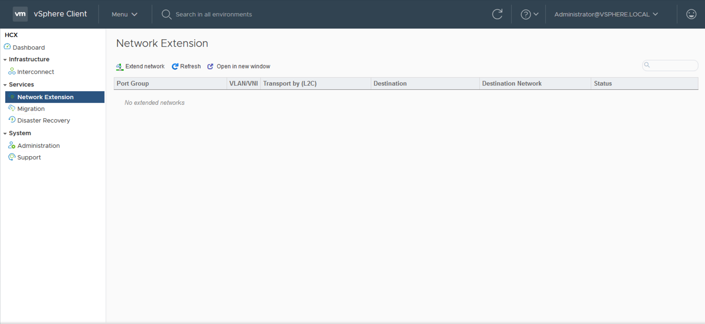
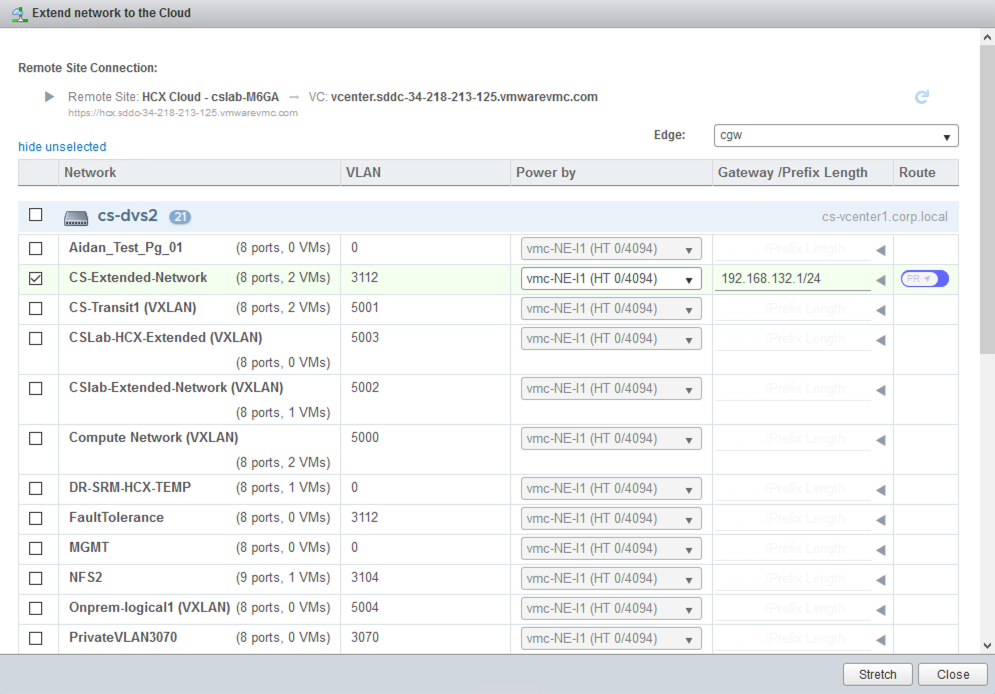
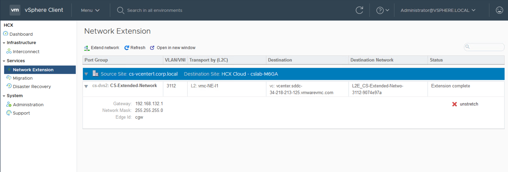
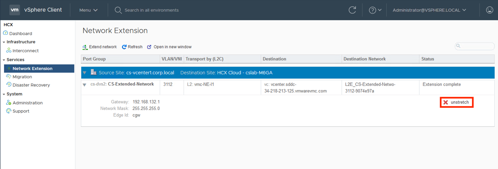
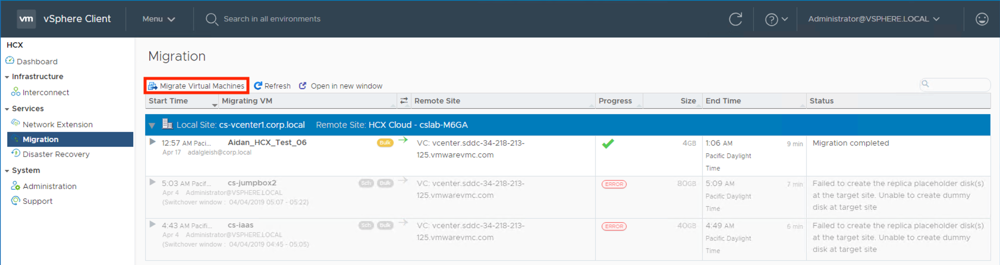
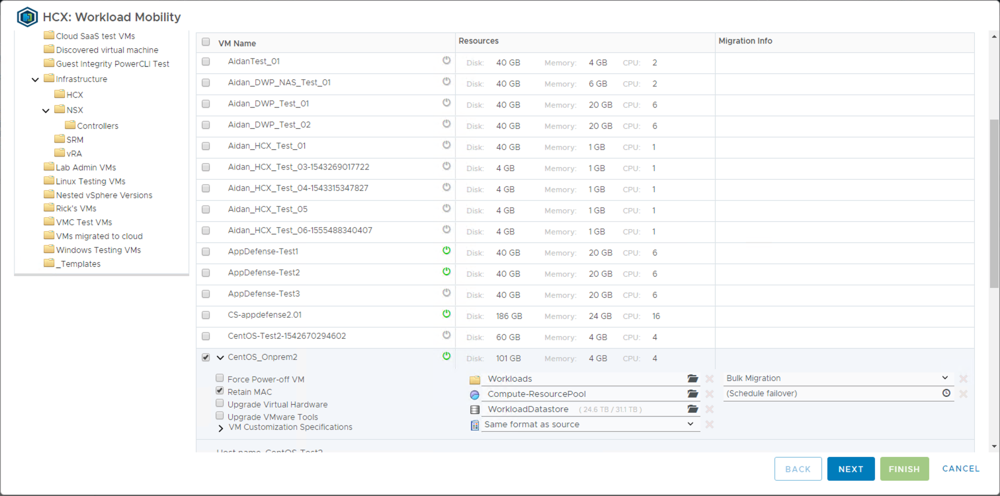
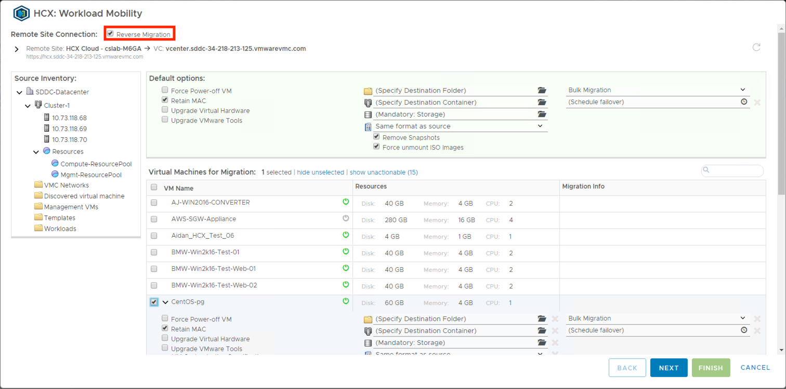

<section markdown="1" id="project-plan">
## Project Plan

<figure markdown="1" class="full-width">

Owner | Due Date | Status | Task | Comments
------|----------|--------|------|---------
      |          |        | Determine networks to be extended for testing. |
      |          |        | Develop a test plan for the migration. |
      |          |        | Execute the test plan and document the results. |
      |          |        | Update estimates for migration times based on test results. |

<button onclick="exportCSV('hcx-testing')" style="float:right;">Export</button>
</figure>

</section>

<section markdown="1" id="verify-network-extension">
## Verify Network Extension
If network extension is required for migration, then an important first step is to verify its functionality. 

<section markdown="1" id="extend-a-network">
### Extend a Network
Identify 1 or more networks to extend and then click on the Network Extension UI from within the HCX dashboard.

<figure>
  
</figure>

You will be presented with a list of port groups which are available for extension to the SDDC. You must tell HCX what the gateway/mask is for extended networks, as doing so will allow HCX to "reserve" this range within the SDDC. This reservation is in place as a means of enabling you to "cutover" the network (i.e. make the network routable/native within the SDDC) at a future date by preventing anyone from creating a conflicting routed network within the SDDC.

In this example, a network is being extended whose gateway is 192.168.132.1/24. Clicking on the "stretch" button will cause HCX to create a "disconnected" (non-routed) network within the SDDC and set up a layer-2 stretch between it and the the on-premises network.

<figure>
  
</figure>

Stretched networks are visible from the Network Extension UI.

<figure>
  
</figure>

You may now place workloads within the stretched network of the SDDC. Assuming you assign these workloads valid address space from the stretched network, they will be able to connect to their peers within the on-premises network as if they were local.

</section>

<section markdown="1" id="unstretch-a-network">
### Unstretch a Network
Unstretching a network is done by selecting the "unstretch" option from an extended network.

<figure>
  
</figure>

Unstretching will simply disconnect the layer-2 extension. It will not delete the network from the SDDC. You have 2 options for how you unstretch:
1. Unstretch as disconnected - This will leave the network as a disconnected network within the SDDC. Workloads on the network will be isolated since their default gateway will no longer be reachable via the layer-2 extension.
2. Unstretch as routed - This will convert the network to a routed network by attaching it to the CGW and assigning it the IP/netmask reserved for the default gateway. The network will then become "native" to the SDDC. In this case, you will end up with a "split brain" situation where both the SDDC and the on-premises networks think that they are authoritative for the network. Generally, you will use this option only when performing a network cutover where you are removing the network from the on-premises environment.

You control the unstretch method using the highlighted checkbox in the below illustration. Checking the box will convert the SDDC network to a routed network.

<figure>
  
</figure>

</section>

</section>

<section markdown="1" id="perform-test-migration">
## Perform a Test Migration
In order to develop a more accurate estimate of total migration times for a project, it will be important to gather baseline performance metrics for a real-world test migration. For testing, you will want to create dedicated test VMs which closely mirror your production workloads. Create small migration waves of a small handful of VMs and test each migration technique which you plan to utilize during the production migration. Gather metrics such as:
* Traffic amounts inbound to the IX appliance and outbound from the WAN-Opt appliance. This will help determine your dedup/compression rates. Low inbound traffic rates to the IX appliance may indicate storage or network bottlenecks in the source site.
* Data replication time for bulk migrations, and average cutover times for the various types of VMs which will be migrated. Understand how hardware and/or vmtool upgrades impact the cutover times.
* The effect of storage conversions on migration workloads (e.g. thick to thin).
* The effect of bulk migrations on applications. How do applications handle the "reboot to cloud" model of bulk migration?
* Migration time for cold migrations and vMotion.
* Network performance. Test latency and throughput for workloads which are utilizing network extension as well as those which are natively routed within the SDDC and reachable via IPSec VPN or Direct Connect.

In addition to gathering metrics for the migration from the source site to the SDDC, you will also want to test the functionality of a reverse migration; where a VM is migrated from the SDDC back to the original source. Understand how upgrades to migrated VMs affect reverse migrations. For bulk migrations, familiarize yourself with the archival locations of migrated VMs on the source site. These may be important for backout planning.

Migration is performed from the Migration UI within the HCX dashboard.

<figure>
  
</figure>

You will select VMs for a given wave and specify their resources and settings on the target site.

<figure>
  
</figure>

Reverse migrations are performed from the same dialog by selecting the "Reverse Migration" checkbox.

<figure>
  
</figure>

</section>
