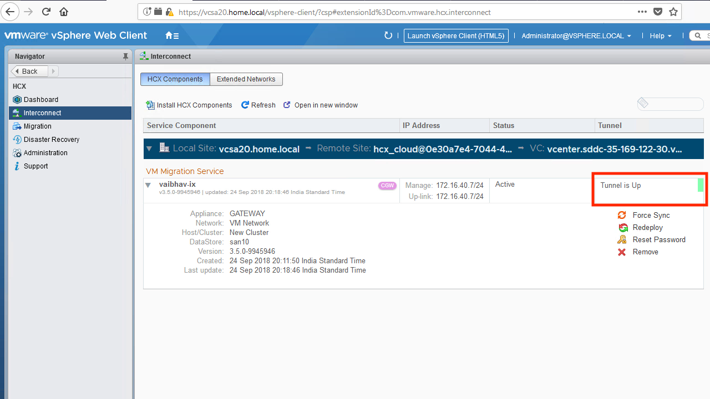

The WAN Interconnect Appliance enables workload replication between sites. It is a required component.

#### Installation Procedure
##### Step 1
From vCenter, navigate to the HCX dashboard. Click on Interconnect -> Install HCX Components. Choose the HCX Interconnect Service from the list of services and hit "next".

<figure>
  
  <figcaption>Step 1</figcaption>
</figure>

##### Step 2
Provide the storage and network properties for the appliance, as well as the passwords. Note that if your vMotion network is not accessible from the management network (e.g. a non-routable vMotion network), then you must configure the optional, 2nd network interface of the appliance and connect it directly to the vMotion network.

<figure>
  
  <figcaption>Step 2</figcaption>
</figure>

##### Step 3
Finish the install to deploy the appliance. Note that a matching appliance will be automatically installed within the SDDC. Once both are up and ready, then they will establish a tunnel between one another. If the tunnel fails to come up, then the most common culprit is a firewall blocking the connectivity.

<figure>
  
  <figcaption>Step 3</figcaption>
</figure>

