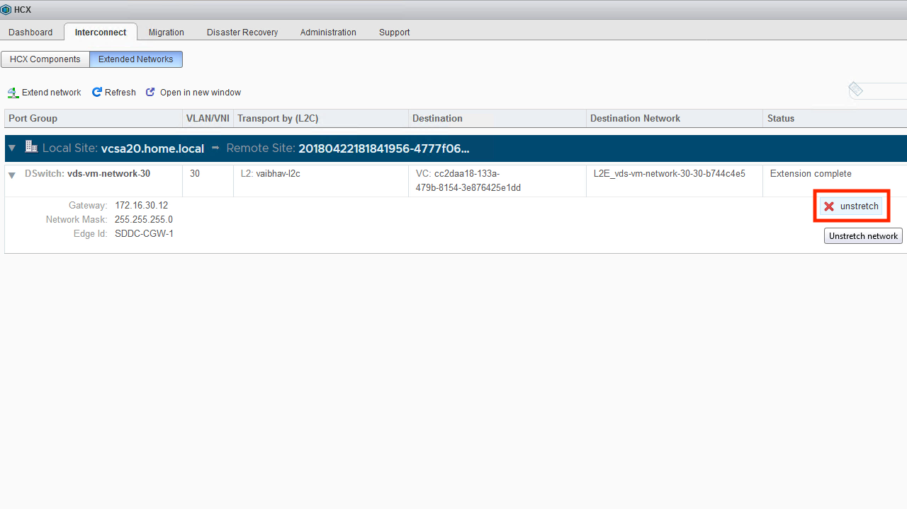

A "network cutover" is the act of migrating a network from the on-premises location into the SDDC. As a prerequisite for a cutover event, the on-premises side of an extended network **must** have been fully evactuated. If the network contains resources which will not be migrating to the SDDC, then they must be moved to another network which will remain within the on-premises environment.

The process for a network cutover is roughly as follows:
1. Prepare the SDDC to act as the authority for the network. This means reviewing the security policy of the SDDC to ensure that workloads will be reachable once the network has been cut-over.
2. Review the routing between the on-premises and the SDDC. Understand what will be required to ensure that the migrated network is known via the SDDC. For example, this may mean adjusting prefix-lists to ensure that BGP routes propagate over IPSec or Direct Connect.
3. Schedule a maintenance.
4. At the start of the maintenance, unstretch the network.
5. Shut down the on-premises version of the network.
6. Adjust routing such that the migrated network is known via the SDDC.
7. Verify connectivity to migrated workloads.

#### Unstretching a Network
Unstretching a network is performed from the HCX dashboard within vCenter.

##### Step 1
From the HCX Dashboard, click Extended Networks from the "Interconnect" tab.

<figure>
  
  <figcaption>Step 1</figcaption>
</figure>

##### Step 2
Click on "unstretch" for the desired network.

<figure>
  
  <figcaption>Step 2</figcaption>
</figure>

##### Step 3
Check the box to plumb the network into the routing infrastructure of the SDDC, and hit "Unstretch".

<figure>
  
  <figcaption>Step 3</figcaption>
</figure>

##### Step 4
The status of the network will change to reflect the tear-down of the extension.

<figure>
  
  <figcaption>Step 4</figcaption>
</figure>
