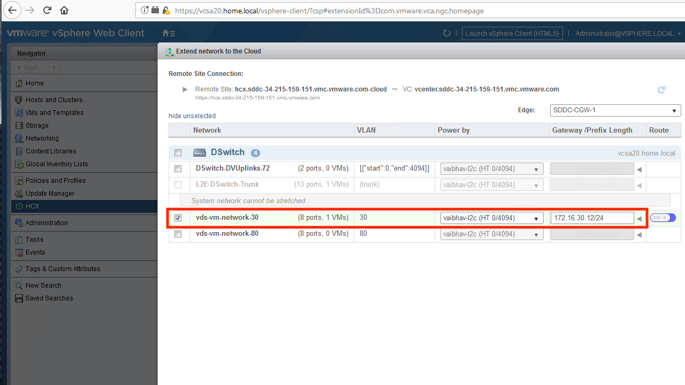
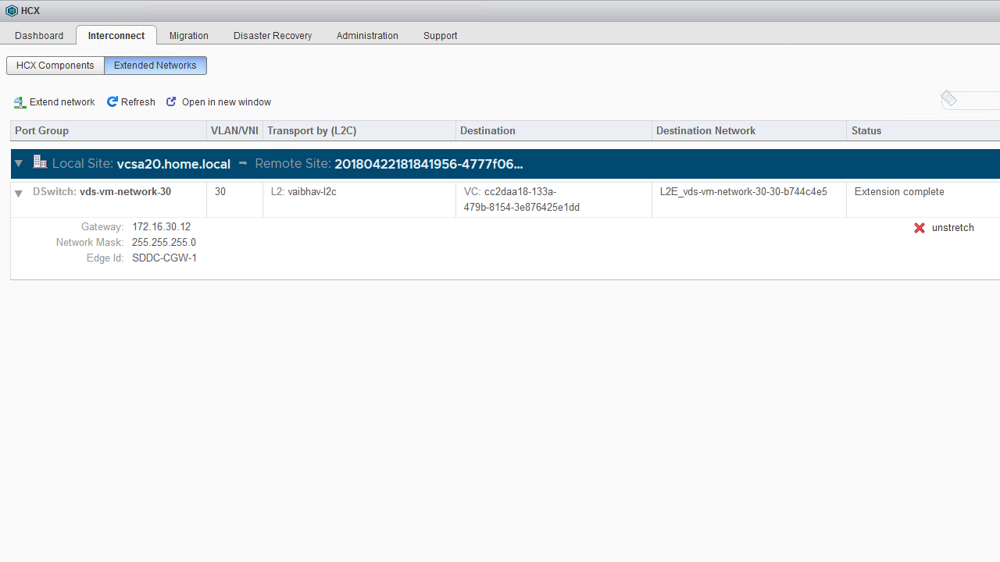

Network Extension can be performed on any port-group which is backed by a VDS to which a WAN Extension Appliance has been attached. When you "extend" a network, HCX will create a duplicate of this network within the SDDC and will create a layer-2 network extension between it and the on-premises port-group. The network which is created in the SDDC is detached from the routing infrastructure of that SDDC. This means that the network is effectivly isolated within the SDDC and that the only "path out" for workloads which are attached to it is through the layer-2 extension to the on-premises network.

#### Extending a Network
These steps are performed from the HCX Dashboard within vCenter.

##### Step 1
From the HCX Dashboard, click Extend Network from the "Interconnect" tab.

<figure>
  
  <figcaption>Step 1</figcaption>
</figure>

##### Step 2
Select the network to extend, and provide the default gateway IP of that network along with the netmask (in CIDR format).

<figure>
  
  <figcaption>Step 2</figcaption>
</figure>

##### Step 3
Upon completion, the network will show up under the list of extended networks. The duplicate network which was created within the SDDC will be visible as the "Destination Network".

<figure>
  
  <figcaption>Step 3</figcaption>
</figure>

#### Additional Notes
* If the port groups being extended are served by different physical uplinks on the DVS, then a separate appliance should be deployed per unique group of uplinks.  The port-groups that share the same uplinks should be manually mapped to the same appliance when extending the networks.
* If multiple appliances are being deployed, and HCX is being used over the public internet, then additional public IP addresses must be assigned to the SDDC. Currently, this is a manual process and the activity should be coordinated by opening a live-chat session with VMware from within the VMC console.
* Multiple appliances can be added with "add another distributed switch" workflow on HCX components page.
* **Do not** extend the management network (where HCX mgmt interfaces exist). Doing so will break the HCX deployment.

