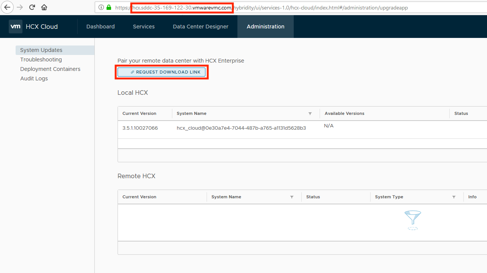

This section covers requirements for activating HCX and installing the on-premises components.

#### DNS Resolution
The on-premises installation of HCX must be able to connect to central HCX services via their [FQDN](https://en.wikipedia.org/wiki/Fully_qualified_domain_name). Therefore, it is critical that any DNS servers used by HCX be able to resolve the following names:
* connect.hcx.vmware.com
* hybridity-depot.vmware.com

If these names are not resolvable by HCX, then the installation will fail.

#### Direct Connect Private VIF Requirements
HCX can be configured to ride atop Direct Connect Private VIF. In order to do so, it requires that an additional range of private IP addresses be allocated to the cloud-side appliances within the SDDC. This address range must be unique and something which will be reachable from the on-premises network. A small range, such as a /29, is sufficent for this. A common practice is to allocate this range from the larger block of address space allocated for the Compute Network of the SDDC.

#### On-Premises IP Address Requirements
The following appliances need an IP address for management:
* HCX Manager
* WAN Interconnect
* WAN Extension

It is a recommended practice to allocate these addresses from the vCenter management network.

**Important Note** - The WAN Interconnect requires connectivity to the vMotion interfaces of ESXi hosts on the on-premises network. If this network is non-routable or otherwise unreachable from the management network, then the appliance will require a second interface/IP directly attached to the vMotion network. This second interface/IP is optional otherwise.

#### vCenter and ESXi Versions
HCX requires certain minimal vCenter/ESXi versions per a give feature. These are as follows:

Feature                      | Versions
-----------------------------|---------
Bulk Migration               | vCenter 5.1+, ESXi 5.0+
vMotion                      | vCenter 5.5+, ESXi 5.0+
Cold Migration               | vCenter 5.5+, ESXi 5.0+
Replication Assisted vMotion | vCenter 5.5+, ESXi 5.5+
Network Extension            | vCenter 5.1+, ESXi 5.1+
Network Extension (NSX)      | vCenter 5.5+, ESXi 5.5+, NSX-v 6.1+
Disaster Recovery            | vCenter 5.1+, ESXi 5.0+

#### vSphere Distributed Switch
If nework extension is required, then you must deploy the WAN Extension appliance. This appliance currently only supports extension of port-groups back by a [vDS](https://www.vmware.com/products/vsphere/distributed-switch.html). In order to avoid creating layer-2 loops, you may only deploy a single appliance per vDS. Once deployed, the WAN Extension appliance will be able to extend any port-group on the vDS (and by definition, the underlying VLAN of that port-group).

**Important Note** - It is possible to have separate vCenter/vDS instances which are backed by the same underlying VLAN infrastructure. In this case, it would be possible to deploy a separate WAN Extension appliance to each. This scenario could create a layer-2 loop which can have a serious impact on your on-premise network. 

#### On-Premises Network Requirements
It is assumed that the on-premises environment has been deployed following VMware recommended practices. A key assumption is that dedicated networks are being used for management, vmotion, etc... HCX cannot extend the management network to the SDDC. If you have workloads which need to be migrated to the SDDC (and use network extension), and these networks reside within the management network, then they must be moved to a non-management network.

HCX needs at least 100Mbps of connectivity to the SDDC (through the internet or Direct Connect). While it is possible for it to run on less, performance will suffer.

#### Appliance LAN Interconnectivity
The on-premises HCX appliances require connectivity to one another on a number of ports. They also require connectivity to/from vCenter and ESXi. If your on-premises network is not restricting internal communications, then you may skip this section. Otherwise, please refer to the following table:

Source           | Destination      | Protocol/Port
-----------------|------------------|---------------
HCX Manager      | WAN Interconnect | TCP 443,8123,9443
HCX Manager      | WAN Extension    | TCP 443
HCX Manager      | vCenter          | TCP 443,7444,9443
HCX Manager      | ESXi management  | TCP 80,902
HCX Manager      | NSX-v Manager    | TCP 443 (only if NSX is present)
vCenter          | HCX Manager      | TCP 443
WAN Interconnect | vCenter          | UDP 902
WAN Interconnect | ESXi management  | TCP 80,902,8000
ESXi management  | WAN Interconnect | TCP 902,8000,31031,44046
users            | HCX Manager      | TCP 443,9443

#### Appliance WAN Connectivity
The HCX components in the on-premises environment must be able to communicate to both centeral HCX services as well as components in the SDDC. For connecting to HCX central services the Manager must be able to either:
* Communicate through a proxy, or
* NAT outbound to a public IP address. A dedicated public IP is **not** required.

For connecting to components in the SDDC, the on-premises appliances must be able to either:
* Communicate directly via Direct Connect Private VIF, or
* NAT outbound to a public IP address. Dedicated public IPs are **not** required.

In general, the on-premises appliances must be able to communicate outbound on TCP 443 and UDP 500/4500. If you must explicitly define outbound security policy per-appliance, then please refer to the following table:

Source           | Destination                 | Protocol/Port
-----------------|-----------------------------|---------------
HCX Manager      | central HCX services        | TCP 443
HCX Manager      | cloud-side HCX Manager      | TCP 443
WAN Interconnect | cloud-side WAN Interconnect | UDP 500,4500
WAN Extension    | cloud-side WAN Extension    | UDP 500,4500

The public IP addresses of cloud-side HCX components are available within the SDDC after HCX has been activated.

#### Critical Network Services
On-premises HCX will require access to the following network services:
* DNS
* NTP
* Syslog

#### Activating HCX
Installation of HCX within an SDDC is performed from the "Add Ons" tab in the SDDC view of the [VMC Console]({{ site.data.links.vmw.vmc }}). Clicking on the "Deploy HCX" button for the specific SDDC will trigger the installation of the cloud-side HCX Manager within that SDDC. Activation keys are also generated from this interface. The activation key is required to activate the on-premises HCX Manager.

You should ensure that if you are running an add blocker in your browser that you whitelist connect.hcx.vmware.com.

<figure>
  
  <figcaption>Activate HCX</figcaption>
</figure>

The HCX Manager within the SDDC is protected by the gateway firewall of the MGW. You must permit access by adding a rule within the [VMC Console]({{ site.data.links.vmw.vmc }}).

<figure>
  
  <figcaption>Permit Access</figcaption>
</figure>

#### Downloading the HCX Manager
The on-premises HCX Manager may be downloaded from the cloud-side HCX manager once the service has been activated. To do so:

1. Open the HCX Manager within the SDDC. This is done from the "Add Ons" tab of the SDDC in the VMC Console. Use the cloudadmin creditials of the SDDC to log into the Manager.

<figure>
  
  <figcaption>Step 1</figcaption>
</figure>

2. Download the on-premises HCX Manager. A download link is availble from the HCX Manager. Be sure to note the FQDN of the cloud-side HCX Manager. This will be needed as part of the installation process for the on-premises HCX Manager.

<figure>
  
  <figcaption>Step 2</figcaption>
</figure>

#### Pre-Flight Checklist
Before getting started, please verify the following:

- [ ] The on-premises vCenter/ESXi/NSX versions meet the minimums
- [ ] The on-premises network has sufficient bandwidth for HCX
- [ ] HCX has been activated
- [ ] HCX manager has been downloaded
- [ ] Activation key has been generated
- [ ] IP addresses have been allocated for on-premises HCX components
- [ ] If using Direct Connect, a range of private addresses has been allocated for cloud-side HCX components
- [ ] The FQDN of the cloud-side HCX Manager has been noted
- [ ] The password for the cloud-side HCX Manager has been noted
- [ ] The URL of the on-premises vCenter server has been noted
- [ ] If using external PSC, its URL has been noted
- [ ] A vDS has been created within the on-premises vCenter (if using network extension)
- [ ] DNS can resolve the public IP addresses of central HCX services
- [ ] Firewalls have been configured to allow outbound connectivity by the on-premises HCX components

