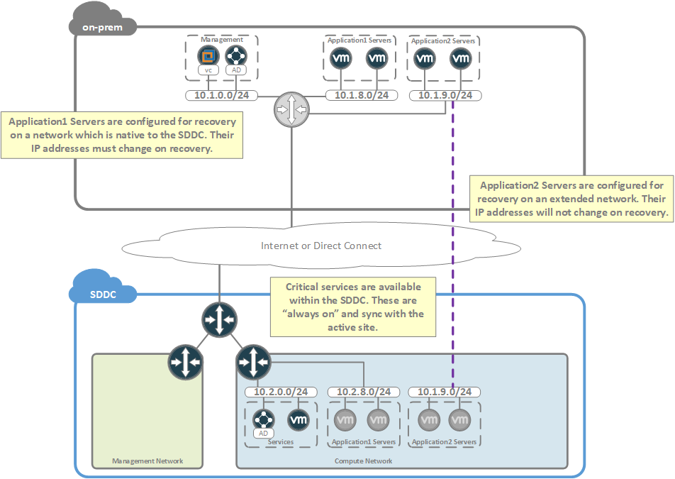

At its core, [HCX]({{ site.data.links.vmw.hcx }}) provides the ability to transparently migrate workloads between vSphere environments. Although this function enables a number of different business cases, the primary cases which will be the focus of this document are:

* Data center evacuations and/or workload migrations
* Disaster recovery

This guide will focus on HCX as applied to [VMware Cloud]({{ site.data.links.vmw.cloud }}).

#### HCX Components
HCX requires that a number of appliance be installed both within the SDDC and within the on-premises environment. These appliances are always deployed in pairs, with 1 on the on-premises side and a twin within the SDDC. Appliances within the SDDC are installed automatically while on-premises appliances must be installed and configured manually.

HCX uses the following appliances:
* Manager - Required. This component provides management functionality to HCX. Within the SDDC, this component is installed automatically as soon as HCX is enabled. Once enabled, a download link will be provided for the on-premises HCX manager appliance. This appliance will be manually installed and will be used to deploy all other components and to drive the operations of HCX.

* WAN Interconnect Appliance - Required. This component facilitates workload replication and migration. The appliance will establish its own dedicated IPSec tunnels for communication to its peer within the SDDC.

* WAN Optimization Appliance - Optional. This component provides WAN optimization and data de-duplication for the WAN Interconnect Appliance. It communicates exclusively with the WAN Interconnect Appliance via private IP (uses addresses from IPv4 range reserved for carrier grade NAT).

* Network Extension (L2C) - Optional. This component provides [Layer-2](https://en.wikipedia.org/wiki/Data_link_layer) network extension for the purposes of "extending" networks between vSphere environments. It will establish its own dedicated IPSec tunnels for communication to its peer within the SDDC.

* Proxy Host - This is a fake ESXi host which is deployed silently by the WAN Interconnect appliance. This host is used to as the target for vmotion/migrations and is used to "trick" vCenter into thinking the migration target host is local. This host will be visible in the inventory of vCenter.

#### An Overview of Workload Migration
The process for workload migration is roughly as follows:
1. Activate the HCX service within the SDDC and deploy on-premises HCX components.
2. Determine a list of workloads to migrate and any networks which must be extended.
3. Develop and execute a test plan for the HCX implementation.
4. Develop a migration plan.
5. Extend networks to the cloud.
6. Begin migrations.
7. Once migrations have completed, perform a "network cutover" by removing network extensions, shutting down the original on-premises networks, and enabling reachability of migrated networks through the IPSec VPN or Direct Connect to the SDDC.

**Important Note** - Network extension, while very common, is completely optional. If your use case does not require workloads to retain their IP addresses post-migration, then there is no need to perform a network extension (or network cutover).

Let's walk through some of the details using the following diagram.

<figure>
  
  <figcaption>Workload Migration</figcaption>
</figure>

In this example, HCX is being used to migrate application workloads and their associated networks to the SDDC. As indicated, the WAN Interconnect appliance (IX) is responsible for data replication between the on-premises environment and the SDDC. This replication traffic is carried over a dedicated IPSec tunnel which is initiated by the on-premises appliance and is optimized using the WAN Optimization appliance (not shown). The Network Extension appliance (L2C) is reponsible for creating a forwarding path for networks which have been extended to the SDDC. Again, this traffic is carried over a dedicated IPSec tunnel which is initiated by the on-premises appliance.

Within the SDDC exists a "Services" network which contains critical services such as DNS or Active Directory which are designed to serve the local environment. In general, it is a good idea to keep such services as close to the consumers (SDDC workloads in this case) as possible. Doing so will not only cut down on network traffic sent to the WAN, but will also reduce dependencies between sites.

We can see from the diagram that a migration is in progress. In this scenario, we are migrating all of the application servers located in the networks 10.1.8.0/24, 10.1.9.0/24, and 10.1.10.0/24. The network 10.1.8.0/24 has already been completely migrated and, as a result, the L2 extension has been disconnected and the on-premises version of the network has been shut down. This network is now accessible directly through the routing infrastructure of the SDDC. This process of making the SDDC the athority for a migrated network is often referred to as a "network cutover".

Workloads from within the networks 10.1.9.0/24 and 10.1.10.0/24 are still in the process of being migrated. As indicated, the L2C is attached to these networks such that it is providing a layer-2 network extension to the SDDC. Due to this network extension, the workloads which have already been migrated have been able to retain their network addresses and, from a routing perspective, appear to reside within the on-premises environment. These "extended" networks are not tied into the routing infrastructure of the SDDC. 

Extended networks present an interesting routing scenario. Due to the fact that they are not tied to the routing infrastructure of the SDDC, the only "way out" for the workloads is via the layer-2 network extension to the on-premises default-gateway. This means that all traffic which is "non-local" to the extended network must pass through the L2C and be routed through the on-premises gateway router. This includes not only communications to resources within the on-premises environment, but also to communications between other extended networks, as well as to networks which are native to the SDDC or to resources within the cross-linked VPC.

This process of forwarding traffic from SDDC -> on-premises -> SDDC between extended networks is referred to as "tromboning", and can result in unexpected WAN utilization and added latency. Since migrations tend to be a temporary activity, this tromboning effect is not typically a major concern. However, it is important to keep in mind when planning migrations such that it may be reduced as much as possible. For layer-2 extensions that are intended to exist in a more permanent fashion, HCX provides a feature by the name of Proximity Routing, which is designed to eliminate the tromboning effect. This feature is not currently supported in VMware Cloud deployments but is currently planned as a roadmap item.

#### An Overview of Disaster Recovery
HCX Disaster Recovery replicates and protects Virtual Machines to an SDDC, and provides flexible configuration of recovery point objectives (RPO) for workloads in intervals from 5 minutes to 24 hours. As an HCX feature, it can take advantage of WAN optimization and de-duplication for replication traffic and can utilize network extension as a means of recovering workloads without requiring IP address changes.

Consider the following illustration.

<figure>
  
  <figcaption>Disaster Recovery</figcaption>
</figure>

In the above scenario, the application servers are being protected by Disaster Recovery using two separate methods. 

Servers in the subnet 10.1.8.0/24 are not required to keep their IP addresses upon recovery, so are being recovered to the 10.2.8.0/24 network which is native to the SDDC. In the event of a failure at the active site, these workloads will be recovered in the SDDC and DHCP will be used to re-assign their IP addresses.

Servers in the subnet 10.1.9.0/24 are operating under a different constraint, and cannot tolerate a change of IP addressing. In this situation, network extension is used to ensure that workloads recovered within the SDDC will not require an IP address change upon recovery.

As a general rule, it is a good practice to maintain a local version of critical services (such as DNS or active directory) which can serve workloads within the SDDC. In this case, servers in the 10.2.8.0/24 subnet would utilize local services in the event of a recovery to the SDDC.
