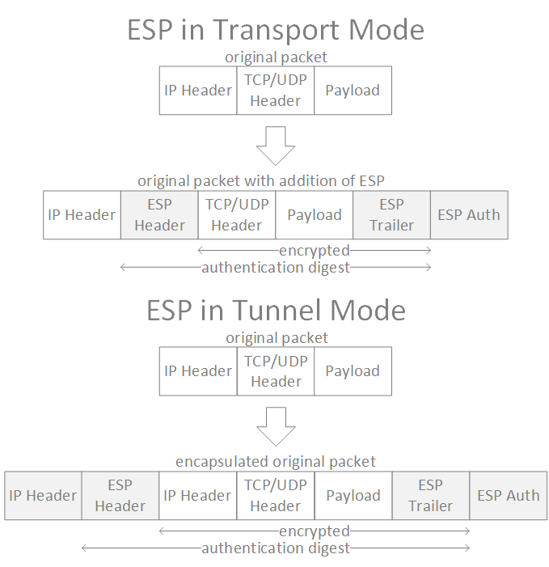

### An Overview of IPSec Components
IPSec is not a single protocol, but rather a suite of protocols designed to provide confidentiality, authentication, and integrity for a VPN. The following are used by IPSec to implement VPN:
* Security Associations - a basic component of IPSec and contains information about the security parameters negotiated between peers.
* Internet Key Exchange (IKE) - a control-plane protocol for management of the VPN tunnel.
* Diffie-Hellman (DH) - the public key exchange algorithm used by IKE to create a secure channel for the control-plane.
* Security Protocols - determine how data-plan traffic is carried through the VPN tunnel.

### Security Associations
A Security Association (SA) is a basic component of IPSec and contains information about the security parameters negotiated between peers. There are two types of SAs:
* IKE (or ISAKMP) SA
* IPSec SA

The IKE SA is used for the control plane of the VPN and contains a combination of mandatory and optional values. These include:
* Encryption Algorithm (mandatory)
* Hash Algorithm (mandatory)
* Authentication Method (mandatory)
* Diffie-Hellman Group (mandatory)
* Lifetime (optional)
 
IPSec SAs are used for the data-plane of the VPN and are stored internally within the Security Association Database (SADB). The SADB is keyed in such a way as to allow the VPN device to match traffic destined to, or received from a VPN to a specific entry within. Each entry stores a number of parameters along side the SA which define how packets matching the entry should be handled. These include:
* Sequence number for packets sent/received on the tunnel
* Anti-replay window for the VPN
* SA lifetime
* Mode (tunnel or transport)
* AH or ESP settings

### Internet Key Exchange
Internet Key Exchange (IKE) is used as a control plane protocol for the VPN tunnel. There are currently 2 versions of the protocol: IKE (or IKEv1) and IKEv2. IKEv2 was developed in order to address the many shortcomings of IKE. These include lack of standardization in certain areas of IKE, enhanced security and reliability, and addressing vulnerabilitys to DOS attacks by IKE implementations. In general, IKEv2 is the preferred protocol when available.

IKE communications are performed using UDP port 500 for both the source and destination. 

##### IKEv1
IKEv1 operates in two phases:

**Phase 1**

Phase 1 provides mutual authentication between peers and establishes the session key for later exchanges. The purpose of this phase is to establish a secure channel for control plane traffic. The result of a successful phase 1 operation is the establishment of an ISAKMP SA which is then used to encrypt and verify all further IKE communications. Phase 1 can operate in two modes: main and aggressive.

Main mode is the more verbose of the two modes and consists of 6 messages sent between peers.

<figure>
  
  <figcaption>IKE Phase1 Main Mode</figcaption>
</figure>

The 1st pair of messages are used to exchange security proposals for IKE. The initiator will offer a one or more sets of parameters which it is willing to support and the receiver will then select a parameter set and echo it back to the initiator. If the receiver cannot support any of the offered parameter sets then it will instead respond with a "reject" message and the phase 1 operation will be considered failed.

The 2nd pair of messages are used to exchange keying materials needed to generate a shared session key. Internally, each peer will used this data to generate and store this shared session key as part of the ISAKMP SA. It is this exchange which makes use of the authentication method parameter since both peers need a mutually agreed upon authentication key in order to derive the session key. Although IKE supports multiple authentication methods, the most common (and easiest to implement) is to use pre-shared keys between peers.

The last pair of messages are encrypted and authenticated using the ISAKMP SA. The function of this exchange is to perform final authentication of the IKE peer.

Aggressive mode performs the same function as main mode but in 3 messages instead of 6. This exchange opts for speed at the cost of some security and is generally less preferred than main mode. As such, we will not cover the details of aggressive mode in this document.

Perfect Forward Secrecy (PFS) is used in order to force IKE Phase 1 to regenerate a new shared key whenever the IPSec SA lifetimes expire. PFS is used to add an extra layer of security to an IPSec VPN by ensuring that if a session key (and thus the associated IPSec SAs) is compromised that it will only be relevant to data which was passed during the lifetime of the compromised IPSec SAs. The use of PFS is generally recommended.

**Phase 2**

Phase 2 uses the ISAKMP SA resulting from Phase 1 to establish the IPSec SAs used to carry IP traffic through the VPN. This phase establishes IPSec SAs (one in each direction) for the VPN connection, and is referred to as Quick Mode. At the conclusion of Phase 2 each peer will be ready to pass data-plane traffic through the VPN. Quick mode consists of 3 messages sent between peers (with an optional 4th message). All messages in phase 2 are secured using the ISAKMP SA established in Phase 1.

<figure>
  
  <figcaption>IKE Phase2 Quick Mode</figcaption>
</figure>

The 1st message is sent by the initiator and is used to advertise sets of parameters which it is willing to support for the IPSec SA. The receiver will select a set of parameters and will echo them back to the initiator as part of the 2nd message (or rejects if it finds no acceptable proposals). The 3rd message is used by the initiator to verify the channel, and an optional 4th message is used by the receiver to signal that it is ready to receive data-plane traffic through the VPN. This "signal when ready" mechanism is used to allow the receiver time to complete the setup on its end prior to accepting any data. If the receiver wishes to implement this feature then it signals this intention as part of the 2nd message.

##### IKEv2
In many ways IKEv2 is a simpler protocol than IKEv1. IKEv2 dispenses with the notion of "phases" and instead breaks the protocol exchange process into 3 groups:
* IKE SA Init - This exchange negotiates cryptographic algorithms, exchanges nonces, and performs Diffie-Hellman exchange. The end result is an encrypted channel for use by the IKE Auth exchange.
* IKE Auth - This exchange is used to authenticate the remote peer. It performs authentication of the previous messages, exchange identities and certificates, and establish the first (and possibly only) IPSec SA.
* Create Child SA and Informational - These exchanges are used to manage Security Associations (for example, creating additional ones or re-keying existing) and perform other "housekeeping" duties.

<figure>
  
  <figcaption>IKEv2 Exchange</figcaption>
</figure>

At minimum, there will be an IKE SA Init and IKE Auth exchange. These exchanges normally consist of four messages but in some scenarios there may be additional messages.

### Security Protocols
IPSec defines two security protocols which determine how data-plane traffic is sent through the VPN tunnel. These are:
* Authentication Header (AH)
* Encapsulating Security Payload (ESP)

IPSec also defines two modes of operation: transport and tunnel.

In transport mode the AH or ESP header is inserted immediately after the original IP header of a packet and the IP protocol number of the packet is changed to either 50 or 51. For this reason it is only useful for establishing an encrypted channel directly between 2 peers.

In tunnel mode the VPN peers encapsulates data packets within an new IP packet. This outer packet uses the source/destination addresses of the VPN peers, contains the AH or ESP header, and uses an IP protocol of either 50 or 51. It is this encapsulation which gives tunnel mode the ability to carry IP traffic for hosts other than the VPN peers. Tunnel mode is what makes it possible to use a VPN to access private IP addresses between sites over the internet.

Authentication Header provides for authentication, data integrity, and anti-replay services. It does not provided confidentiality (encryption). The following diagram illustrates the structure of an AH packet in both transport and tunnel modes.

<figure>
  
  <figcaption>Authentication Header</figcaption>
</figure>

AH packets are identified by IP protocol 51. The AH header provides a security parameter index and sequence number which allow the VPN peers to associate received packets with an appropriate SA and enables anti-replay services. It also contains an authentication digest which is used to authenticate the packet and ensures data integrity for the entire packet. This is an important point; the digest is for the entire packet including the AH header and all immutable fields of the outermost IP header. It is this digest that prevents AH from working when the VPN peers are behind a NAT gateway. Since NAT makes changes to the IP and TCP/UDP headers of a packet, the digest will always be incorrect post-NAT and the receiving peer will reject the packet. In short, AH will not work behind a NAT gateway.

Encapsulating Security Payload provides for authentication, data integrity, confidentiality (encryption), and anti-replay services. The following diagram illustrates the structure of an ESP packet in both transport and tunnel modes.

<figure>
  
  <figcaption>Encapsulating Security Payload</figcaption>
</figure>

ESP packets are identified by IP protocol 50. Like the AH header, the ESP header provides both a security parameter index and sequence number which serve the same purpose as with AH. Since ESP provides encryption, the header also contains several fields required by the encryption protocols. Additionally, the ESP header provides an authentication digest which is calculated, post-encryption, on the contained data. It is important to note that this digest covers only the encrypted portion of the packet and does not include the outer IP or ESP headers. Unlike with AH, NAT and ESP can coexist in certain situations. When using transport mode ESP will only function behind a NAT gateway if the NAT translation is 1:1. When operating in tunnel mode ESP can function without issue behind a NAT gateway.

 
### Diffie-Hellman
Diffie-Hellman (DH) is the public key exchange algorithm used by IKE to calculate the shared session key. DH defines a number of groups, which refer to the Oakley protocol, and define the overal strength (security) of the key exchange. The DH group used between peers is determined from the IKE proposal exchange.

#### IPSec VPN and NAT
NAT can cause problems with IKE due to the fact that NAT devices tend to modify source IP addresses and TCP/UDP ports. As mentioned previously, IKE requires that peers exchange messages using UDP 500 for both source and destination port. Additionally, IKE authentication is often performed using the source IP of the peer and this authentication tends to fail when modified by NAT. In order to get around these issues IKE makes use of NAT Traversal (NAT-T) when the initiator is located behind a NAT device.
 
NAT-T performs three functions:
1. It determines if the remote peer supports NAT-T
2. It detects the presence of a NAT device between peers
3. It uses UDP encapsulation to adjust for the presence of a NAT device

For IKEv1, the 1st and 2nd functions are performed as part of the phase 1 negotiation; for IKEv2 this is performed within the IKE SA Init exchange. The first function is simple and is advertised as a parameter within the phase 1 proposal exchange or IKE SA Init exchange. The second function is a bit more complex and requires checking a hash of the source/destination IP and source UDP port used by the sender. This hash will then be recomputed and checked by each receiving peer. If a NAT device modifies these addresses then the computed hash will not match the advertised hash and the peers will be alerted to the presence of a NAT device.

If a NAT device is detected then the initiator must change ports of all subsequent exchanges to UDP 4500 (for both source and destination). The receiver will also adjust to use UDP a destination port of 4500 on packets destined for the initiator. As part of the NAT-T function, all data-plane packets sent through the VPN will be encapsulated using UDP 4500 between peers. Typically, peers of a NAT-T VPN will also send periodic keepalive messages in order to keep the NAT translation for the VPN from expiring.

### References
* https://tools.ietf.org/html/rfc2407
* https://tools.ietf.org/html/rfc2408
* https://tools.ietf.org/html/rfc2409
* https://tools.ietf.org/html/rfc4306
* https://tools.ietf.org/html/rfc3715
* http://www.ciscopress.com/store/ipsec-vpn-design-9781587051111
