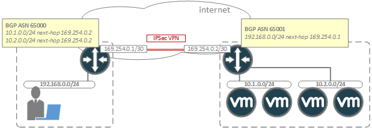

### Policy-Based VPN
Policy-based VPN operates on the notion of creating a policy which defines "interesting" traffic which should be sent through the VPN. These policies are created based on source/destination [CIDR](https://en.wikipedia.org/wiki/Classless_Inter-Domain_Routing) pair definitions representing groups of IP networks which should be allowed to communicate through the VPN. This policy is then applied to an outbound (or uplink) interface on the VPN device. Any traffic which passes through this interface is checked for a match against the policy, and if the IP source/destination of the packet matches, then the packet is sent through the VPN. If no match occurs, then the traffic is routed through the interface normally.

<figure>
  
  <figcaption>Policy-Based VPN</figcaption>
</figure>

Using the above diagram as an example, a policy-based VPN has been configured between 2 environments. In this example, the edge routers on each network have been configured with policies which permit connectivity between the private address space of each network. In this case, the administrator has chosen to create a separate policy definition for each network pair which needs to communicate through the VPN. Note that the policy on either end matches, but is created as a "mirror" copy of the peer device. Most VPN implementations will create a dedicated Security Association (SA) for each entry in the policy, and these SAs will be used to create a separate "tunnel" within the VPN. If one device happens to implement a policy which does not have a cooresponding matching entry on the peer, then that particual tunnel will not come up. In this situation, the VPN may show up as "partially up" depending on the implementation.

In the diagram, let's assume that the user attempts to connect to a public DNS server with an IP address of 8.8.8.8. The request would pass through the edge router and through the interface where the policy is applied, but since there is no matching policy definition for this request, the packet is forwarded out to the internet. 

Now, assume that the user attempts to access a VM on the 10.1.0.0/24 network. Again, the request is routed up to the edge router and through the interface where the policy is applied. This time there is match on the policy, so the request is encapsulated within an ESP packet and forwarded through the VPN to the remote peer, where it is decapsulated and forwarded to the appropriate VM. The response from the VM would behave in a similar manner; passing through the edge router, hitting the policy, and being encapsulated and forwarded through the VPN to the edge router of the user's network.

A key thing to keep in mind with policy-based VPN is that traffic which is indended to pass through the VPN **must** always pass through the interface where the policy is applied. In the above scenario this is guaranteed since the edge router is the only outbound path for traffic. However, in more complex networks with multiple paths, routing may need to be specifically configured in such a way to force traffic through the VPN device (and specifically out through the interface where the policy is applied). 

### Route-Based VPN
Route-based VPN was developed as a more flexible means of implementing VPN. With policy-based VPN, there was an administrative burded required to specifically define policies for every source/desination IP range which should pass through the VPN. This made large-scale implementations difficult to manage.

Route-based VPN operates on the notion of creating a "virtual wire" between VPN peers, which may then be treated as if it were a general purpose cross-link between routers. This allows the routers to exchange routes dynamically between VPN peers such that the "virtual wire" is seen as just another routed-hop in the network.

<figure>
  
  <figcaption>Route-Based VPN</figcaption>
</figure>

In the illustration, a route-based VPN has been configured between the edge routers of the 2 networks. This VPN is implemented by creating a virtual tunnel interface (VTI) on each device which is given an IP address on the link-local network 169.254.0.0/30. [BGP](https://en.wikipedia.org/wiki/Border_Gateway_Protocol) is then configured across this link and routes are exchanged between the routers. With route-based VPN, the VPN peers will establish a single SA/tunnel for the "any" route of 0.0.0.0/0. This SA is suitable for encapsulating any traffic which is sent across the VPN.

Since BGP is dynamically exchanging routes, there is no need to "force" traffic through an interface as there is with policy-based VPN. If a user attempts to access a network which is being learned via BGP, then their traffic will simply be routed through the VTI of the VPN. The return traffic from the remote network would follow an identical process.

Route-based VPN offers considerable advantages over policy-based VPN including the ability to configure redundant VPNs, using separate devices, which will automatically fail-over (due to BGP routing) in the event of a failure of the primary tunnel. Route-based VPN may also be easier to manage and troubleshoot in the majority of deployments, despite the additional BGP configurations required.
