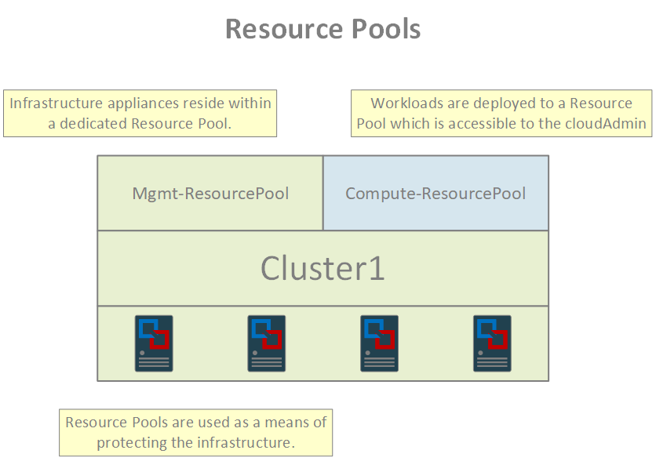

In order to prevent the cloudAdmin from modifying the infrastructure components of the SDDC, vCenter is configured to use Resource Pools and segmented vSAN Data Stores. The cloudAdmin role is then granted permissions only to the resources designated for its use. The specifics for this setup are described below.

##### vCenter Resource Pools

Resource management within vCenter is enforced through the use of Resource Pools. Using this model, infrastructure-level appliances exist within one Resource Pool while compute workloads exist within another. The cloudAdmin role does not have permissions to modify the resources within the management pool.

<figure>
  
  <figcaption>Resource Pools</figcaption>
</figure>

##### vSAN Datastores

Access to storage is managed using a similar model as Resource Pools. Within an SDDC, the vSAN cluster has been modified to present two logical Datastores; one for the infrastructure appliances, and another for compute workloads. As with the Resource Pool model, the cloudAdmin role does not have access to the Datastore used by the infrastructure appliances.

<figure>
  
  <figcaption>vSAN Datastores</figcaption>
</figure>

##### vSAN Storage Policies

Total usable storage within an SDDC is a function of a couple of variables. Firstly, the vSAN storage policy applied to VMs effects the amount of overhead required for data storage. Secondly, the ability of dedup & compressing to reduce the storage footprint plays a role.

Taking a look at the table below, we can see that each policy consists of a Failures to Tolerate setting and a Fault Tolerance Method.

FTT |  FTM  | Hosts Required | Required Capacity
----|-------|----------------|------------------
1   | RAID1 | 3              | 2X
1   | RAID5 | 4              | 1.33X
2   | RAID1 | 4              | 3X
2   | RAID6 | 6              | 1.5X
3   | RAID1 | 7              | 4X

<figcaption>vSAN FTT/FTM Configurations</figcaption> 

Each combination requires a certain minimum number of hosts and has an associated "cost" in terms of storage overhead required to implement. For example, we can see that the first policy in the table requires twice the storage space to implement the policy. This is because RAID1 mirroring is duplicated each storage object twice in order to implement the FTT value of 1.

With vSAN, it is required to have a default storage policy and it is this policy which is used by VMs that do not have a storage policy explicitly defined on them.
 The default storage policy for an SDDC uses an FTM of RAID1 with an FTT of 1.
 For SDDCs with 6 or more hosts, then an FTT of 2 will be used.

It should be noted that VMware will automatically add hosts to the SDDC when storage utilization crosses the 70% threshold, even when EDRS is disabled. This practice is a preventative measure designed to ensure that vSAN has a minimal amount of "slack" space available to it at all times.

Finally, the [VMC Sizer]({{ site.data.links.vmw.vmcaws_sizer }}) tool has been made available as a means of assisting customers with estimating the number of hosts required to meet their storage demands.

##### Elastic Distributed Resource Scheduler (EDRS)

EDRS is a feature which enables an SDDC to scale based on its resource utilization. With EDRS, when utilization remains consistently above any of the scale-out thresholds, then the SDDC will automatically add a host. Conversely, when utilization is consistently below any of the scale-in thresholds, then the SDDC will automatically remove a host.

EDRS is configured on a per-SDDC basis, and comes in two flavors: optimized for cost, or optimized for performance. The difference between the two variants has to do with how aggressively a scale-in or scale-out action occurs. When optimized for cost, the SDDC will be more conservative when scaling-out but more eager to scale-in. When optimized for performance, the opposite is true.
