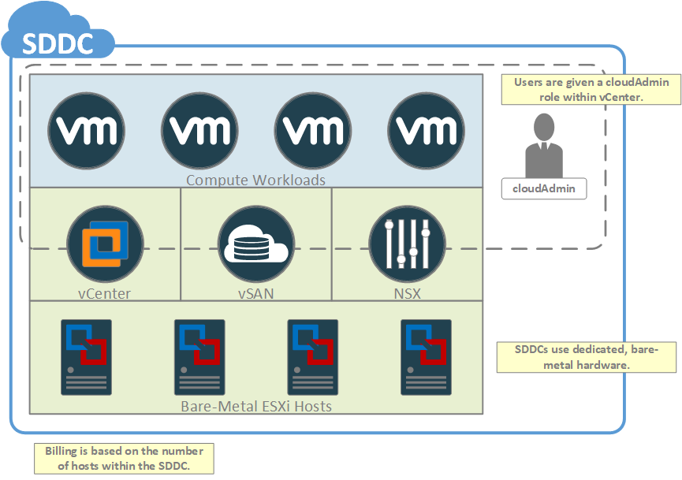

#### Introduction
Prior to getting started with the VMware Cloud on AWS service, it is critical to understand the basic components of the service. As a starting point, the following items should be well understood:
* the Software Defined Data Center (SDDC)
* the VMware Cloud Org
* the customer AWS account
* integration with AWS services

These items are discussed below.

#### Software Defined Data Center (SDDC)

The Software Defined Data Center (SDDC) is a collection of bare-metal hosts which are installed with a standard set of VMware software. It is important to understand that each SDDC is running atop dedicated hardware and that billing for an SDDC is based upon the number of hosts dedicated to the SDDC and not the number of VMs running within the SDDC.

Since VMware Cloud On AWS is a managed service, full admin-level access to the SDDC is not permitted. This restriction is in place to prevent customers from modifying the infrastructure of the SDDC itself.  Instead, customers are given a role which allows them to fully manage workloads which they have deployed within the SDDC. Normally, this permissions model does not impact day-to-day use of the service, however, it's important to keep in mind if you are planning on integrating tools directly with infrastructure components such as vCenter. If the integration you are planning requires admin rights, then it may not function properly. We recommend you review the 3rd party service's documentation for the requirements around full admin-level access to the SDDC.

<figure>
  
  <figcaption>Software Defined Data Center (SDDC)</figcaption>
</figure>

Key points to remember regarding the SDDC:
* It is deployed on dedicated, bare-metal hosts.
* It is Deployed with standard components (ESXi, vCenter, NSX, vSAN).
* Billing is based on the number of hosts within the SDDC, not on the number of VMs.
* Users have the ability to manage their workloads but have limited access to vCenter,vSAN, and NSX.

#### The VMware Cloud Organization
This is the top-level "container" for all SDDCs. This topic was discussed in-depth in the chapter titled "Getting Started".

#### Amazon Web Services Account

A major benefit of the service is its ability to provide direct access to AWS services. As such, it is required that all customers maintain a dedicated AWS account which will be used to access and manage these services.  If you are unsure of how to create an AWS account, then please refer to the [AWS Documentation]({{ site.data.links.aws.create_acct }}/) for more information on the process.

A few important points on the AWS account:

* The account provides access to AWS services from a customer's VMware Cloud resources, and is required in order to deploy an SDDC.
* The account is owned by the customer, not by VMware.
* Billing for the account is handled directly by AWS, not by VMware

#### Integration with AWS Services

Each SDDC is provided direct access to AWS services via a connection to a customer-owned AWS account. This connection is established as part of the SDDC provisioning process, and is performed using one of two methods:

* By choosing an AWS account which has previously been connected to another SDDC, or
* By creating a new connection to an AWS account

The term "connected" simply means that the customer has granted permissions for the VMware Cloud On AWS service to enable routing between an SDDC and a [VPC]({{ site.data.links.aws.vpc_subnets }}) within the customer-owned AWS account. These permissions are granted via [IAM]({{ site.data.links.aws.iam }}) roles which are created within the connected account using a [CloudFormation]({{ site.data.links.aws.cloudformation }}) template. It is important to note that the person who is performing the account connection process must have sufficient permissions (eg. admin rights) within the AWS account to execute this CloudFormation template.

<figure>
  
  <figcaption>Integration with AWS Services</figcaption>
</figure>

Key points to remember:
* AWS services are managed through a customer-owned AWS account.
* Account linking enables VMware Cloud services to cross-link SDDCs into a customer-owned AWS account.
* Account linking is performed when the user executes a CloudFormation template within their AWS account.
* The CloudFormation template creates roles which enable VMware to manage SDDC cross-linking.
* Each SDDC is cross-linked to VPC/Subnet via a series of ENIs.
* The [Availability Zone]({{ site.data.links.aws.regions_az }}) (AZ) of the x-link Subnet will determine AZ of the SDDC.

Once a connection is established to the AWS account, it then becomes possible to configure a cross-link between an SDDC and a VPC within that account. The cross-link itself consists of a series of [Elastic Network Interfaces]({{ site.data.links.aws.eni }}) (ENI) which are attached to a Subnet within the VPC. It is these ENIs which provide the hosts of an SDDC with a network forwarding path to resources within the account. The topic of SDDC cross-linking will be explored in more detail later on, but for now it is important to keep the following considerations in mind when selecting a VPC/Subnet for the cross-linking:

* The VPC must exist within the same Region which is planned to house the SDDC.
* The Subnet must be sufficiently large to accommodate one ENI per host within the SDDC. Typically, a /26 is the minimum recommended size for the Subnet.
* Subnets are associated with an Availability Zone (AZ), therefore the choice of Subnet determines the Availability Zone into which the SDDC hardware is provisioned. The purpose of this is to avoid cross-AZ bandwidth charges between the SDDC and the Subnet used for cross-linking (see AWS [billing policies]({{ site.data.links.aws.data_transfer }}) for details).
* It is recommended to use a dedicated Subnet for cross-linking. The purpose of this is to ensure that IP addresses within the Subnet are not consumed by other services (e.g. other EC2 instances) thus preventing ENIs for new hosts from being added as the SDDC grows. Secondary to that, using a dedicated Subnet helps prevent the situation where an AWS admin accidentally deletes or otherwise modifies the ENIs used for cross-linking.
* It is possible to cross-link multiple SDDCs to the same AWS account. If you plan to do this, then it is vital to ensure that you do not create IP addressing conflicts by using overlapping IP address ranges between the SDDCs. This is particularly relevant if you plan to cross-link multiple SDDCs to the same VPC.
