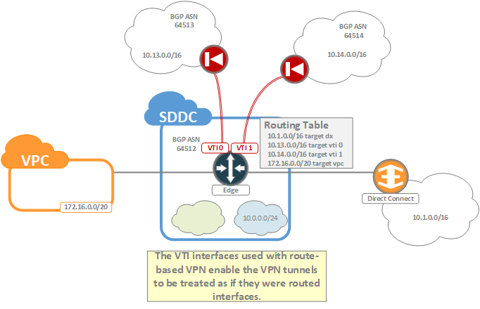

Each SDDC supports the termination of both policy-based and route-based VPNs to the tier-0 edge gateway. Although the choice of which type of VPN to implement is ultimately a matter of preference, in general, the recommendation is to use route-based VPN whenever possible. The reasons for this recommendation will be discussed in the sections below.

#### Policy-Based VPN
As discussed in the **IPSec VPN** chapter of the section on **Networking**, policy-based VPN relies on defining "interesting" traffic as part of a policy for determining which traffic should be sent through a VPN. This policy is then applied to an interface (typically an uplink port) of the VPN endpoint, and traffic destined for the VPN is then forced through this interface. In the case of the SDDC, this policy is applied to the "internet" uplink of the tier-0 edge router.

As part of its standard configuration, the SDDC is configured with a default route which points to the upstream IGW. This means that all traffic which is non-local to the SDDC will be sent out through the "internet" uplink and will be matched against any IPSec VPN policies which are applied. If the traffic matches a policy, then it is encapsulated and sent through a VPN. Otherwise it is routed normally to the IGW. The notable exception to this rule is in cases where the SDDC knows specific routes through alternative uplinks. The first example of this will be with the cross-linked VPC. Traffic destined for this VPC will not cross the internet uplink and will not be matched against any policies. Similarly, if Direct Connect is attached to the SDDC, then traffic destined to any networks learned via the Direct Connect will also not pass through the internet uplink. 

<figure>
  
  <figcaption>Policy-Based VPN</figcaption>
</figure>

This highlights an important caveat to policy-based VPN; if any routes are learned via alternative uplinks (i.e. Direct Connect, cross-linked VPC, other route-based VPNs) which encompass networks configured on the policy-based VPN, then the traffic will not pass through the internet uplink and will not hit the policy. Effectively, this means that you must carefully plan what routes you advertise to the SDDC if you intend to use policy-based VPN in conjunction with Direct Connect or route-based VPN.

#### Route-Based VPN
Route-based VPN works on the notion that a Virtual Tunnel Interface (VTI) exists between the two VPN peers. This VTI is protected by IPSec encryption, but is otherwise treated as a normal uplink, over which BGP peering is established, and over which traffic may be routed.

<figure>
  
  <figcaption>Route-Based VPN</figcaption>
</figure>

Within the SDDC, the VTI interfaces are created on the tier-0 edge as a type of uplink over which a BGP session is established. Routes learned over these BGP sessions populate the routing table and add an extral layer of functionality to the IPSec VPN. For example, with route-based VPN it becomes possible to enable redundant tunnels by taking advantage of BGP to handle the fail-over between tunnels, and it becomes possible to more granularly control routing between all uplinks of the edge.

The added flexiblity and configurability of route-based VPN is one of the main reasons for it being the preferred solution for IPSec VPN configurations.
