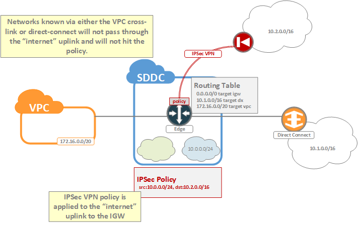
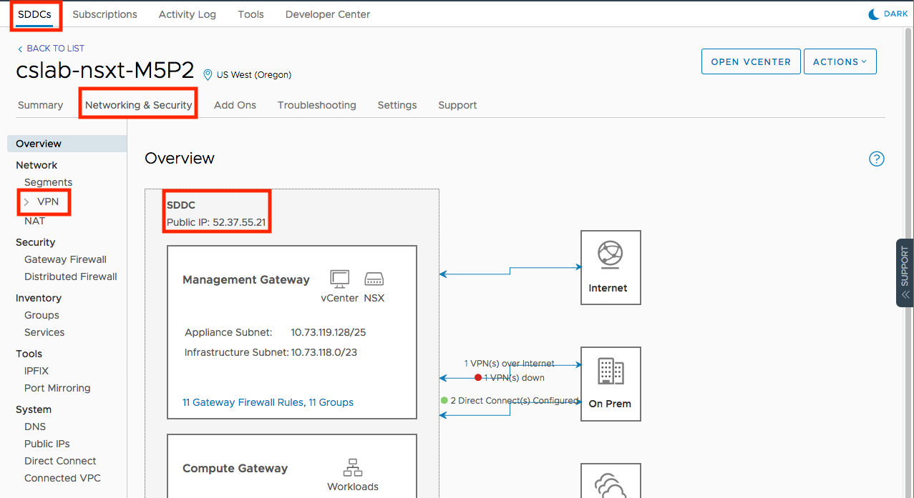
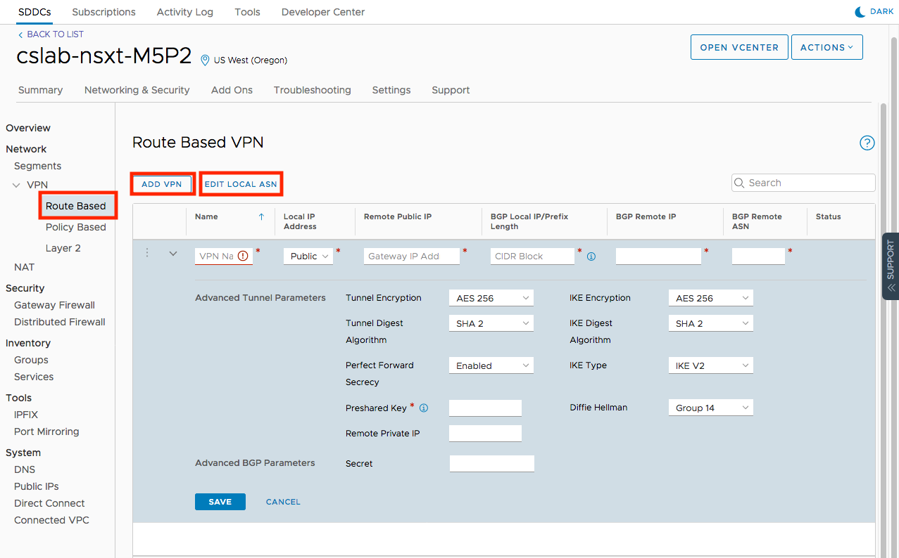

Each SDDC supports the termination of both policy-based and route-based VPNs to the tier-0 edge gateway. Althought the choice of which type of VPN to implement is ultimately a matter of preference, in general, the recommendation is to use route-based VPN whenever possible. The reasons for this recommendation will be discussed in the sections below.

#### Policy-Based VPN
As discussed in the **IPSec VPN** chapter of the section on **Networking**, policy-based VPN relies on defining "interesting" traffic as part of a policy for determining which traffic should be sent through a VPN. This policy is then applied to an interface (typically an uplink port) of the VPN endpoint, and traffic destined for the VPN is then forced through this interface. In the case of the SDDC, this policy is applied to the "internet" uplink of the tier-0 edge router.

As part of its standard configuration, the SDDC is configured with a default route which points to the upstream IGW. This means that all traffic which is non-local to the SDDC will be sent out through the "internet" uplink and will be matched against any IPSec VPN policies which are applied. If the traffic matches a policy, then it is encapsulated and sent through a VPN. Otherwise it is routed normally to the IGW. The notable exception to this rule is in cases where the SDDC knows specific routes through alternative uplinks. The first example of this will be with the cross-linked VPC. Traffic destined for this VPC will not cross the internet uplink and will not be matched against any policies. Similarly, if Direct Connect is attached to the SDDC, then traffic destined to any networks learned via the Direct Connect will also not pass through the internet uplink. 

<figure>
  
  <figcaption>Policy-Based VPN</figcaption>
</figure>

This highlights an important caveat to policy-based VPN; if any routes are learned via alternative uplinks (i.e. Direct Connect, cross-linked VPC, other route-based VPNs) which encompass networks configured on the policy-based VPN, then the traffic will not pass through the internet uplink and will not hit the policy. Effectively, this means that you must carefully plan what routes you advertise to the SDDC if you intend to use policy-based VPN in conjunction with Direct Connect or route-based VPN.

#### Route-Based VPN
Route-based VPN works on the notion that a Virtual Tunnel Interface (VTI) exists between the two vpn peers. This VTI is protected by IPSec encryption, but is otherwise treated as a normal uplink, over which BGP peering is established, and over which traffic may be routed.

<figure>
  
  <figcaption>Route-Based VPN</figcaption>
</figure>

Within the SDDC, the VTI interfaces are created on the tier-0 edge as a type of uplink over which a BGP session is established. Routes learned over these BGP sessions populate the routing table and add an extral layer of functionality to the IPSec VPN. For example, with route-based VPN it becomes possible to enable redundant tunnels by taking advantage of BGP to handle the fail-over between tunnels, and it becomes possible to more granularly control routing between all uplinks of the edge.

The added flexiblity and configurability of route-based VPN is one of the main reasons for it being the preferred solution for IPSec VPN configurations.

## Configuration

IPSec VPN is configured from within the [VMC console](https://vmc.vmware.com) by navigating to the Network & Security tab of the SDDC. The public VPN IP of the tier-0 edge is visible on the Overview page. The VPN item on the left-hand navigation will provide options for configuring both Policy and Route Based VPN.

<figure>
  
  <figcaption>Step 1</figcaption>
</figure>

#### Policy-Based VPN
To create a policy-based VPN, click on the Policy Based menu item on the left-hand navigation pane and then click the Add VPN button.

<figure>
  
  <figcaption>Step 1</figcaption>
</figure>

The fields are as follows:
* Name - Give the VPN a name which is meaningful to you.
* Local IP Address - You may choose to bind the VPN to either the public or private IP of the edge gateway. For policy-based VPN, you should choose the public IP.
* Remote Public IP - Provide the public IP of the remote VPN peer.
* Remote Private IP - If the remote VPN peer is behind a NAT gateway, then provide its real IP address here. This will be used by NAT-T.
* Remote Networks - Provide a comma-delimited list of networks which should be reachable by the SDDC via the VPN (e.g. 10.0.0.0/8).
* Local Networks - Choose which networks within the SDDC should be reachable from the remote network via the VPN.
* Advanced - These are the crypto settings for the VPN.
  - IKE Type - the IKE version to use
  - Tunnel Encryption and Tunnel Digest Algorithm - these are the IKE phase 2 or IPSec Proposal settings for IKEv1 and IKEv2 respectively.
  - IKE Encryption and IKE Digest Algorithm - these are the IKE phase 1 or IKE crypto settings for IKEv1 and IKEv2 respectively.
  - Perfect Forward Secrecy - Enable or disable PFS. It is recommended to enable.
  - Preshared Key - the secret key for the VPN.
  - Diffie Hellman - the [DH](https://en.wikipedia.org/wiki/Diffie-Hellman_key_exchange) group to use.

#### Route-Based VPN
To create a route-based VPN, click on the Route Based menu item on the left-hand navigation pane and then click the Add VPN button.

<figure>
  
  <figcaption>Step 1</figcaption>
</figure>

The first step you should complete is to set the SDDCs BGP [ASN](https://en.wikipedia.org/wiki/Autonomous_system_(Internet)). You should typically use an ASN from the designated private range (64512 - 65534).

Most of the fields are identical to the ones defined for policy-based VPN, however, there are a few differences:
* BGP Local IP/Prefix Length - The IP address to use for the SDDC side of the VTI (e.g. 169.254.255.1/30)
* BGP Remote IP - The IP address of the remote end of the VTI (e.g. 169.254.255.2)
* BGP Remote ASN - The ASN of the remote VPN peer.
* Advanced BGP Parameters - A secret key for the BGP session.

#### Important Tips
Once you have configured and saved the VPN settings a link will appear which allows you to download the configuration for the VPN. Although this configuration is not vendor specific, the information is extremely helpful for configuring the remote VPN peer since it provides additional details not shown in the UI. Once you have downloaded the configuration, the next step will be to configure the remote end of the VPN. 

The following are things to consider when configuring VPN:
* Most implementations of policy-based VPN will set up one Security Association per Remote/Local network pair, and 1 tunnel will be used for each. Your policies must match networks on both ends *exactly* in order for a given tunnel to come up. If one or more tunnels do not come up then the VPN will show as partially connected.
* Crypto settings must match on both ends or the tunnel will fail to come up.
* The most common problem with VPN is mismatching configurations. Triple check your settings if your VPN fails to come up. You can get an idea of where the mismatch is based on which phase of the VPN failed.
* The second most common problem with VPN is firewall or NAT. If your VPN device is behind a firewall then make sure that IP protocol 50 is permitted. If your device is behind a NAT gateway then make sure that UDP 500/4500 are permitted through and that you have provided the Remote Private IP of the peer.

### Route-Based VPN Sample Device Configurations
The following sample configurations are designed to provide examples of known working configurations. However, they will require modification to your specific setup in order to actually work. These configurations are based on the following setup in the SDDC:

Setting | Value
--------|-------
Local IP Address | edge public IP 52.39.110.92
Remote Private IP | in the case of this setup, the remote VPN was behind a NAT gateway and had a private iP of 192.168.250.43
IKE Type | configs provided for both IKEv1 and IKEv2
Tunnel Encryption | AES 256
Tunnel Digest Algorithm | SHA2
IKE Encryption | AES 256
IKE Digest Algorithm | SHA2
Perfect Forward Secrecy | enabled
Preshared Key | myverysecretkey
Diffie Hellman | Group 14
BGP Local IP/Prefix Length | 169.254.255.1/30
BGP Remote IP | 169.254.255.2
BGP Remote ASN | 64512
SDDC ASN Setting | 64513

<figcaption>SDDC VPN Settings</figcaption> 

Testing was performed to an EC2 instance in AWS. EC2 instances use NAT, so we must be sure to open up UDP 500/4500 (for NAT-t) inbound in the security group for the device.

#### Route-Based VPN: Cisco CSR (IOS XR) IKEv1

<pre class="mycode"><code>
! specify the pre-share key for the remote sddc edge
crypto keyring sddc
  ! the local private ip address
  local-address 192.168.250.43
  ! pre-shared key with sddc edge
  pre-shared-key address 52.39.110.92 key myverysecretkey
exit

! phase1 crypto - AES 256 SHA2-256
crypto isakmp policy 1
  encryption aes 256
  hash sha256
  authentication pre-share
  group 14
  ! this is typically a default setting
  lifetime 86400
exit

! create a profile for the remote sddc edge
crypto isakmp profile isakmp-sddc
  keyring sddc
  ! ip of sddc edge
  match identity address 52.39.110.92
  ! the local private ip address
  local-address 192.168.250.43
exit

! phase2 crypto - AES 256 SHA2-256. always use tunnel mode
crypto ipsec transform-set ipsec-sddc esp-aes 256 esp-sha256-hmac 
  mode tunnel
exit

! phase2 ipsec profile
crypto ipsec profile ipsec-profile-sddc
  set transform-set ipsec-sddc
  set pfs group14
  ! this is typically a default setting
  set security-association lifetime seconds 3600
exit

crypto ipsec df-bit clear
crypto isakmp keepalive 60 2 on-demand
crypto ipsec security-association replay window-size 128
crypto ipsec fragmentation before-encryption

! a fake network we will use for testing. this is definitely optional
interface Loopback0
 ip address 192.168.251.1 255.255.255.0
exit

! the VTI interface for route-based vpn
interface Tunnel0
  ! can use link-local address range here. use a range which is not currently in use on this router or the sddc edge
  ip address 169.254.255.2 255.255.255.252
  ip virtual-reassembly
  ! use the local private ip
  tunnel source 192.168.250.43
  ! ip of the sddc edge
  tunnel destination 52.39.110.92
  tunnel mode ipsec ipv4
  ! this enables ipsec encryption for the VTI
  tunnel protection ipsec profile ipsec-profile-sddc
  ip tcp adjust-mss 1379
  no shutdown
exit

! enable bgp with local asn
router bgp 64512
  ! the neighbor should be the VTI address of the sddc edge. use the asn specified in the vmc console
  neighbor 169.254.255.1 remote-as 64513
  neighbor 169.254.255.1 activate
  neighbor 169.254.255.1 timers 60 180 180
  address-family ipv4 unicast
    ! as a test, we will advertise the fake network we created on Loopback 0
    network 192.168.251.0 mask 255.255.255.0
    neighbor 169.254.255.1 activate
    neighbor 169.254.255.1 soft-reconfiguration inbound

  exit
exit
</code></pre>

#### Route-Based VPN: Cisco CSR (IOS XR) IKEv2

<pre class="mycode"><code>
! ikev2 crypto - AWS-256-CBC SHA-256
crypto ikev2 proposal ikev2-prop-sddc 
 encryption aes-cbc-256
 integrity sha256
 group 14
exit

! define an ikev2 policy
crypto ikev2 policy ikev2-policy-sddc 
 match fvrf any
 proposal ikev2-prop-sddc
exit

! define keyring for pre-shared key
crypto ikev2 keyring ikev2-keyring-sddc
 peer sddc
  ! ip of sddc edge
  address 52.39.110.92
  pre-shared-key myverysecretkey
  exit
exit

! ikev2 profile
crypto ikev2 profile ikev2-profile-sddc
 ! ip of sddc edge
 match identity remote address 52.39.110.92 255.255.255.255 
 ! local private ip of this router
 identity local address 192.168.250.43
 authentication remote pre-share
 authentication local pre-share
 keyring local ikev2-keyring-sddc
exit

crypto ikev2 dpd 60 2 on-demand
crypto ipsec security-association replay window-size 128
crypto ipsec df-bit clear

! ipsec proposal - AES-256 SHA-256
crypto ipsec transform-set ipsec-sddc esp-aes 256 esp-sha256-hmac 
 mode tunnel
exit

! ipsec profile using previously configured parameters
crypto ipsec profile ipsec-profile-sddc
 set transform-set ipsec-sddc 
 set pfs group14
 set ikev2-profile ikev2-profile-sddc
exit

! a fake network we will use for testing. this is definitely optional
interface Loopback0
 ip address 192.168.251.1 255.255.255.0
exit

! the VTI interface for route-based vpn
interface Tunnel0
  ! can use link-local address range here. use a range which is not currently in use on this router or the sddc edge
  ip address 169.254.255.2 255.255.255.252
  ip virtual-reassembly
  ! use the local private ip
  tunnel source 192.168.250.43
  ! ip of the sddc edge
  tunnel destination 52.39.110.92
  tunnel mode ipsec ipv4
  ! this enables ipsec encryption for the VTI
  tunnel protection ipsec profile ipsec-profile-sddc
  ip tcp adjust-mss 1379
  no shutdown
exit

! enable bgp with local asn
router bgp 64512
  ! the neighbor should be the VTI address of the sddc edge. use the asn specified in the vmc console
  neighbor 169.254.255.1 remote-as 64513
  neighbor 169.254.255.1 activate
  neighbor 169.254.255.1 timers 60 180 180
  address-family ipv4 unicast
    ! as a test, we will advertise the fake network we created on Loopback 0
    network 192.168.251.0 mask 255.255.255.0
    neighbor 169.254.255.1 activate
    neighbor 169.254.255.1 soft-reconfiguration inbound
  exit
exit
</code></pre>

