<section markdown="1" id="overview">
## Overview
Network security within an SDDC is enforced by 2 types of firewalls: the NSX gateway firewall and the NSX distributed firewall (DFW). 

<figure>
  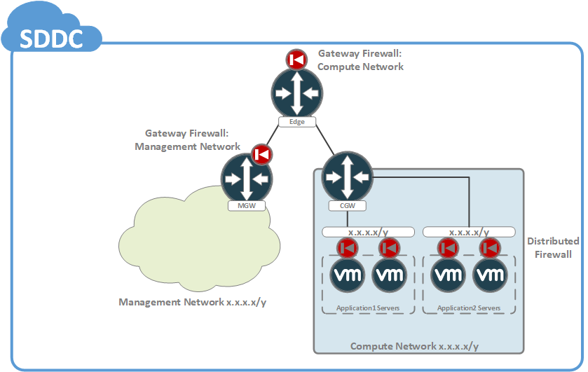
  <figcaption>The SDDC Network Security Model</figcaption>
</figure>

These firewalls are designed to address network security policy enforcement in 2 different ways, with the gateway firewalls enforcing policy at the network border and DFW enforcing policy within the compute network of the SDDC. Keep the following points in mind with the NSX firewalls:
1. As with most firewalls, NSX firewall rules are evaluated top-to-bottom with the first matching rule being applied to a new connection.
2. Firewall policy is applied bidirectionally. In other words, new network connections will be evaluated against the ruleset both ingress to the SDDC and egress from the SDDC.
3. The firewalls are stateful. This means that if a request is permitted through the firewall policy, then the response is automatically permitted through.
4. NSX uses group and service definitions as part of firewall rule creation.

Network security within an SDDC is configured from the Network & Security tab of the SDDC view from within the VMC console. The following sections will provide more details on the concepts used within each of the firewalls, and provide a brief overview of how to configure them.
</section>

<section markdown="1" id="groups-and-services">
## Groups and Services
Firewall rules in NSX are based upon group and services definitions. While services may be defined "universally" within the VMC console, groups are defined separately between the management and compute networks. 

<section markdown="1" id="concepts">
### Services
A service definition may be thought of as collections of 1 or more protocols (IP, ICMP, UDP, TCP, etc...) and their associated ports/types. Although many of the standard service definitions have been pre-created within the SDDC, it is sometimes necessary or convenient to create custom definitions. The process for doing so is as follows:

#### Create a new service definition
1. Navigate to the Network & Security tab of the SDDC.
2. Click on Service within the left-hand navigation menu.
3. Click on Add New Service.
4. Name the service.
5. Define the service by clicking on Set Service Entries (see next section).
6. Save the service when finished.

<figure>
  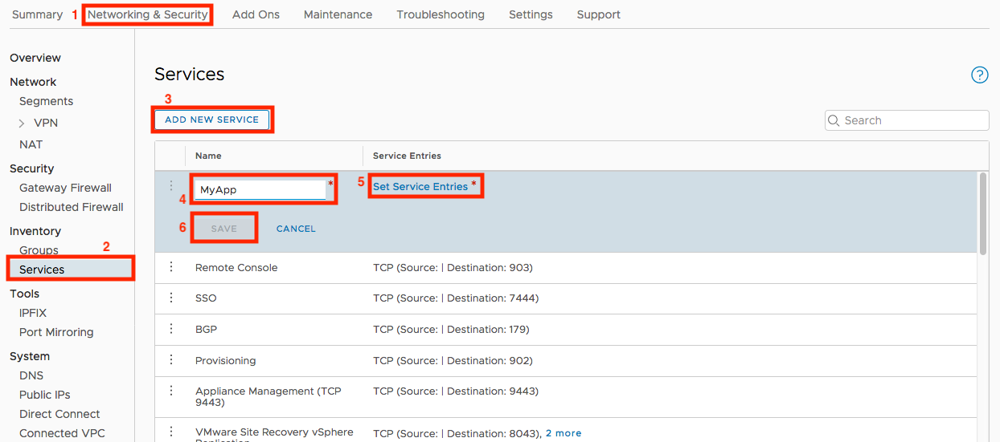
</figure>

#### Set Service Entries
Services may be defined for a variety of protocols. The criteria which may be set are specific to the given protocol.

<figure>
  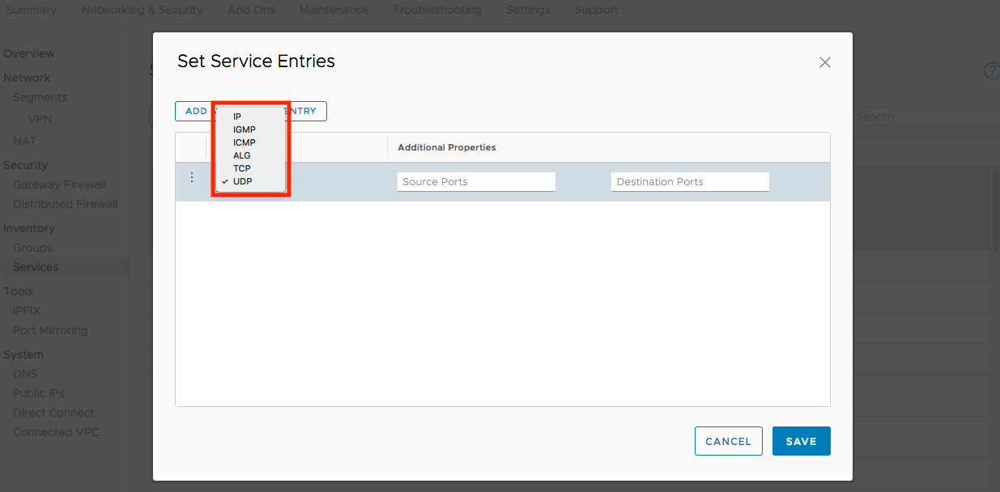
</figure>

To set an entry:
1. Click Add New Service Entry.
2. Choose a service type (protocol) and define the criteria.
3. Save when finished.

<figure>
  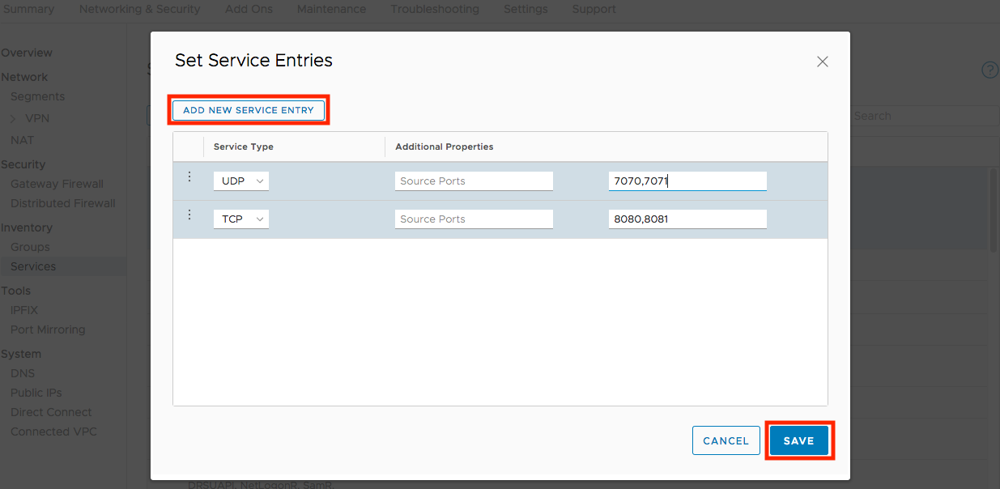
</figure>

The example shown above illustrates a service definition for a custom application which uses both UDP and TCP. Although possible to specify source ports with UDP and TCP, you will very rarely do so. In the vast majority of cases you should set the destination ports only since source ports for a given connection tend to be randomized over a very broad range of values.
</section>

<section markdown="1" id="concepts">
### Groups
Groups should be thought of as representing 2 classes of resources:
* VMs within a given network of the SDDC, and
* IP addresses which are external to a given network within the SDDC

Unlike services, which are defined globally within the SDDC, groups are scoped per the management and compute networks. Groups are managed from the Network & Security tab of the SDDC.

<figure>
  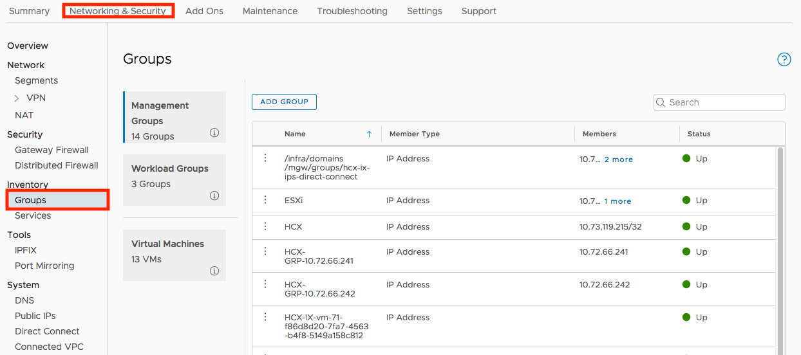
</figure>

As seen in the illustration, the UI separates groups into Management Groups (management network) and Workload Groups (compute network). The Virtual Machines section allows you to set security tags on individual VMs. It should be noted that security tags are a completely separate set of tags and are not related to VM tags in vCenter.

#### Management Groups
For Management Groups, you are restricted to defining groups based on IP address. This is because groups for the management appliances have been pre-created within the SDDC and, by definition, anything which is external to the management network may only be reference by IP.

<figure>
  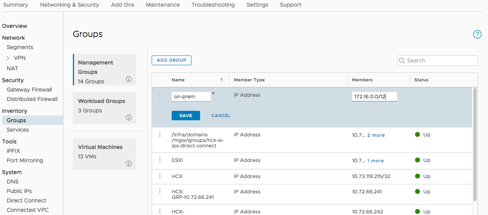
</figure>

#### Workload Groups
With Workload Groups you have more flexibility: groups definitions here may be based on the following constructs:
* Virtual Machine - with this construct, you explicitly set individual VMs.
* IP Address - here you may specify a comma-delimited list of IP networks in CIDR format.
* Membership Criteria - this construct supports matching on VM name or security tag.

<figure>
  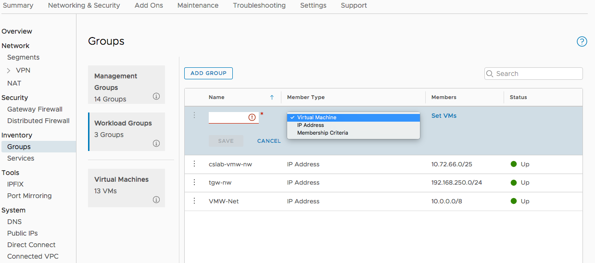
</figure>

Be sure to note the maximums for each type of construct within a group definition. 

#### Membership Criteria
Currently, Membership Criteria for groups may only be based on VM name and security tag. 

<figure>
  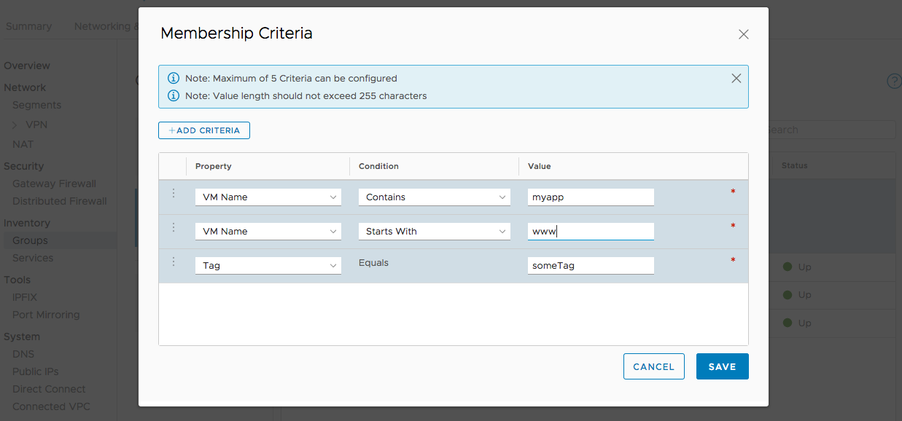
</figure>

It is also important to understand that Membership Criteria follows a "logical OR" model (a.k.a. "match any"). In the example, you can see that there are 3 criteria defined. Due to the logical OR model, VMs will match this group if they meet any one of the defined criteria. As a future roadmap item a "logical AND" model (a.k.a. "match all") will be supported. This type of model would require that a VM match all defined criteria in order to be considered part of the group.
</section>
</section>

<section markdown="1" id="gateway-firewalls">
## The Gateway Firewalls
Since the gateway firewalls are enforced on the NSX edge routers, they may be thought of as behaving like traditional centralized firewalls. Within the SDDC, they are responsible for enforcing network security policy at the border of their respective networks. It is important to understand the following points regarding the gateway firewalls:
1. The default security policy of the gateway firewalls are that of "default deny".
2. There are 2 points of enforcement for the gateway firewalls: on the tier-0 edge router and on the MGW.

Beginning with the first point, the "default deny" policy requires the security administrator to explicitly define traffic which should be permitted through the firewalls. Keeping in mind that the firewall rule set applies bidirectionally, the security administrator must define permitted traffic both ingress and egress. Since the firewalls are stateful, responses for permitted traffic will always be permitted.

Regarding the second point, it is important to understand how and why the gateway firewalls are applied as they are. 

The entry point for the entire SDDC is the tier-0 edge router. This is the first point of enforcement for the gateway firewall, and as a result this edge device had the potential to protect all networks within the SDDC. However, a design decision was made to exclude the management network of the SDDC from the gateway firewall of the tier-0 edge. This means that the gateway firewall of the tier-0 edge only protects the compute networks of the SDDC. This design decision makes sense when you consider that the MGW router (which borders the management network) has its own gateway firewall. Since the MGW is already protecting the management network, protection of the management network at the tier-0 edge would be redundant and confusing, and was thus removed.

This begs the question of "Why enable the gateway firewall on the MGW?". Since it is desirable to protect the management network from not only the external world but also from the compute network, enforcement of security policy at the border of the management network is necessary. By enabling the gateway firewall on the MGW, the security administrator has the ability to protect the management network from the entire world from a single point of administration.

<figure>
  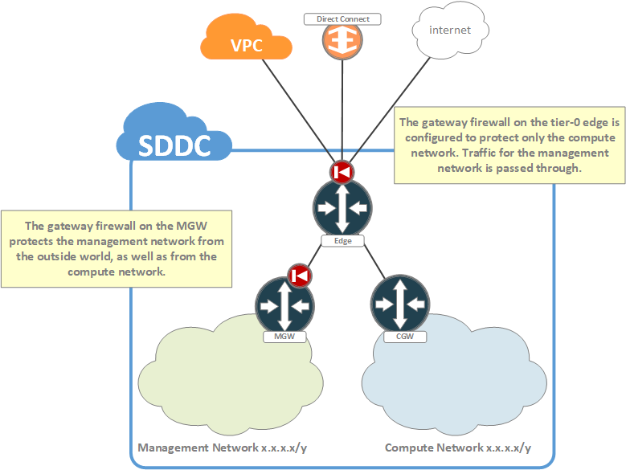
  <figcaption>The Gateway Firewalls</figcaption>
</figure>

Although it is good to understand the how and why behind the design of the gateway firewalls, these details aren't specifically necessary in order to effectively manage security policy. From the perspective of the end-user, the VMC console abstracts these details away and presents a simplified view which displays a pair of rulesets: one labeled Management Gateway and another labeled Compute Gateway.

<figure>
  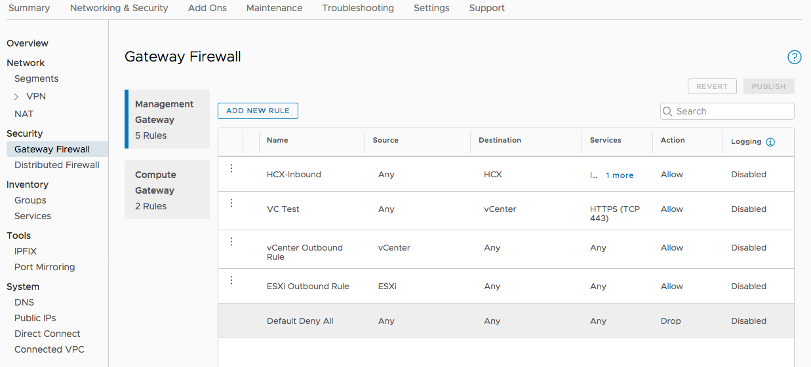
</figure>

This UI layout is designed to focus the security administrator on the policies themselves rather than drawing attention to where and how they are enforced.

Creating security policy for the gateway firewalls is performed as follows:
1. Navigate to the Network & Security tab of the SDDC within the VMC console.
2. Click on Gateway Firewall from the left-hand navigation, and choose either the Management Gateway or Compute Gateway ruleset.
3. Click on Add New Rule.
4. Provide the required fields for the new rule.
5. When finished adding rules, publish the ruleset.

<figure>
  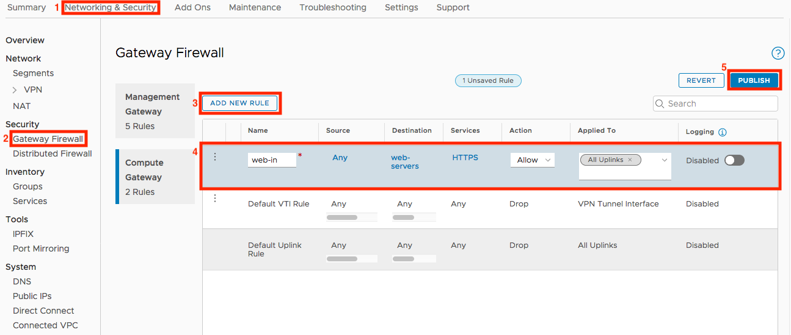
</figure>

In the example, a rule is being created which will permit inbound HTTPS traffic to web servers. Let's examine the fields of the rule in detail.
* Name - A meaningful name for the new rule.
* Source - The source of the request. In this example we are using the pre-defined value of Any which permits any source. We could have also chosen to use a custom defined group.
* Destination - The destination for the request. In this example we are using a custom group which contains web servers.
* Services - One or more services. In this example we are using a pre-created service for HTTPS.
* Action - Allow the traffic or Drop the traffic.
* Applied To - This field is unique to the Compute Gateway ruleset and will be explained later.
* Logging - Enable or disable logging for matches on this rule. This helps with testing and troubleshooting, but may impact performance. Use logging sparingly.

Keep in mind that there is no inherent direction for firewall rules. Since security policy is applied bi-directionally, direction is specified through the use of the source and destination fields.

Additional options for rules are available from the context menu of each rule.

<figure>
  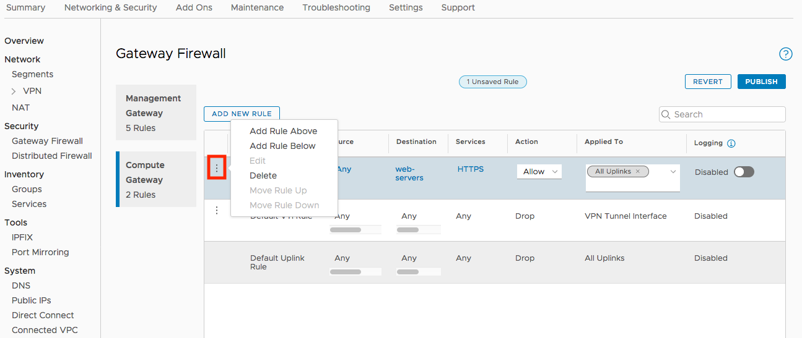
</figure>

Although it impacts security policy in a very critical way, the Applied To field and its purpose are not always well understood. Firstly, it is important to understand why this field is not available on the Management Gateway ruleset. Since the MGW has a single uplink (its uplink to the tier-0 edge), its ruleset is simply applied to that interface. Security policy for the compute network is a bit more complex, however. Since this policy is enforced on the tier-0 edge itself, and this edge has multiple uplinks, you must select where each individual rule is applied by setting the Applied To field of the rule. By default, the All Uplinks value is selected; however, other options are available.

<figure>
  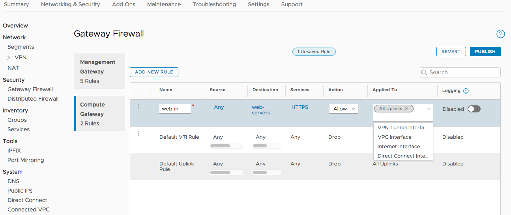
</figure>

It is important to understand these options:
* Internet Interface - As the name implies, this is the uplink to the AWS public network.
* VPC Interface - This refers to the uplink for the cross-account ENI connection to the customer-owned AWS account.
* Direct Connect Interface - When a Direct Connect has been attached to the SDDC, this is the uplink for the private VIF of that Direct Connect.
* All Uplinks - A shorthand option for the Internet, VPC, and Direct Connect interfaces.
* VPN Tunnel Interface - This option refers to VTI interfaces for any route-based VPNs which may have been created.

The All Uplinks option is particularly important to call out since there tends to be some confusion around its meaning. All Uplinks refers to "physical" uplink interfaces of the tier-0 edge, which are outlined in more detail in the chapter on SDDC network architecture. What is not included as a physical uplink are Virtual Tunnel Interfaces (VTI) used by route-based VPNs. These interfaces are implemented in a very different way within NSX and are treated as a separate category of interface. When working with route-based VPN, the security administrator must remember to specifically apply policies to the VPN Tunnel Interface. Note the distinct callout for route-based VPN. This callout is intentional due to the fact that route-based VPNs are the only type of VPN to use VTI interfaces. Policy-based VPN relies on VPN policies which are applied to the physical uplinks of the tier-0 edge. In the case of policy-based VPN, rules applied to the uplinks would also apply to those VPNs. See the chapter on IPSec VPN for more information on the differences between route-based and policy-based VPN.

One last important consideration with rules applied to the VTI interfaces of route-based VPN has to do with the address space used by the VTIs themselves. It is a common practices to use the IPv4 link-local range (169.254.0.0/16) for point-to-point links such as VTI interfaces. As a convenience, this range has been whitelisted in the Compute Gateway ruleset in order to ensure that a BGP session may be established over the VPN. If you use address space for VTI interfaces which is outside of the link-local range, then you must remember to specifically permit control traffic such as BGP.
</section>

<section markdown="1" id="dfw">
## The Distributed Firewall
The distributed firewall (DFW) represents a break from traditional, centralized firewalls in that it is not enforced in a central location (as with the gateway firewalls) but is enforced at the vNIC of each VM in the compute network. By enforcing security policy at the absolute edge of the network, it becomes possible to manage network security policy in ways which are difficult to replicate in a traditional data center network.

The distributed firewall is available from the Network & Security tab of the SDDC view within the VMC console.

<figure>
  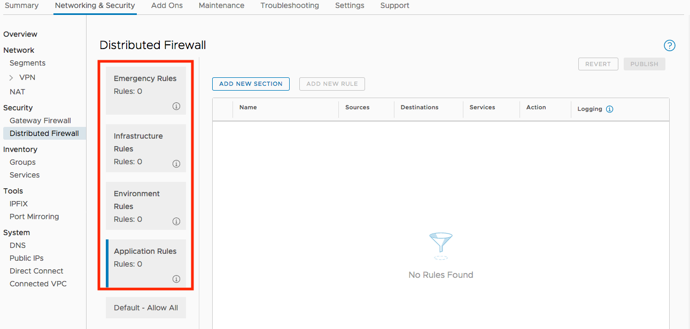
</figure>

The ruleset for DFW is organized around the concept of sections. As highlighted above, there are 4 pre-created sections for DFW. These are conveniences which have been added to the UI in order to direct the security administrator into a the good practice of organizing security policy. The key thing to remember is that sections are an organizational tool only. Rules within NSX firewalls are evaluated top-to-bottom independently of sections. This means that rules in the Emergency Rules section will be evaluated before rules in the sections below it (and so on). Keep this point in mind particularly when creating "deny" or "reject" rules.

Keep the following points in mind with DFW:
* It has a "default permit" policy, meaning it is effectively disabled by default.
* It is applied only to the compute network.
* It may filter network traffic both north-south and east-west.
* It is included as part of the NSX Advanced feature set add-on for the SDDC.

In order to prevent confusion with the dual layers of gateway + distributed firewalling, the default security policy of DFW is set such that it is effectively disabled. In order to use DFW, the security administrator must specifically construct "drop" or "reject" rules. Currently, the default policy of DFW cannot be changed but this behavior will change with future releases of the product.

The purpose of DFW is to enable the security administrator to construct security policy which may be applied within the compute network itself. As an example, a typical use of DFW is to provide security between the tiers of a multi-tiered application, or to provide security between separate tenants within the SDDC. DFW is unique in that it is applied at the absolute edge of the network. This feature effectively decouples network security from network architecture. To illustrate this point, imagine a traditional data center network. Typically, if security was needed between tenants or between tiers of an application, then network architecture would be designed to reflect this separation (i.e. a VLAN per tenant or application tier). In this model, if security requirements changed then the network infrastructure would need to be altered and workloads migrated and re-IPed. With DFW, security policy is agnostic of network architecture and may be enforced regardless of VM placement within the SDDC. Due to this decoupling, it is possible to provide security between tenants or application tiers even when the workloads reside within the same subnet. If security policy changes, then workload migrations and IP changes are not necessarily required.

As mentioned, DFW rules are organized into sections. Within the pre-created sections for DFW (e.g. Emergency Rules, Infrastructure Rules, etc...), additional sections may be created.

<figure>
  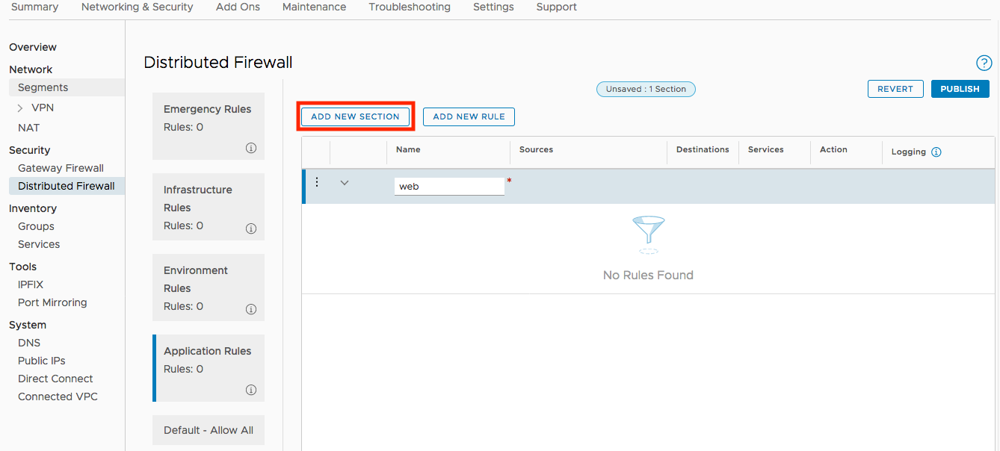
</figure>

It is a good practice to organize rules into sections based upon some meaningful distinction. Once a section has been created, rules may be added from its context menu.

<figure>
  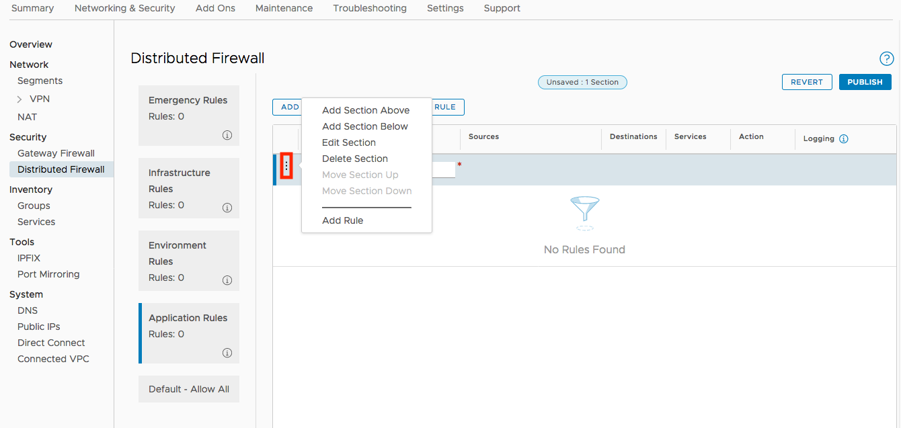
</figure>

You will note that the fields of DFW rules are similar to the gateway firewall rules, although there is the notable lack of an Applied To field. This is because DFW is applied to the vNIC of every VM in the compute network.

In this example a section has been created for web servers. Per the ruleset, HTTPS is permitted inbound with all other traffic being denied. We have chosen to add this policy as part of our Application Rules section.

<figure>
  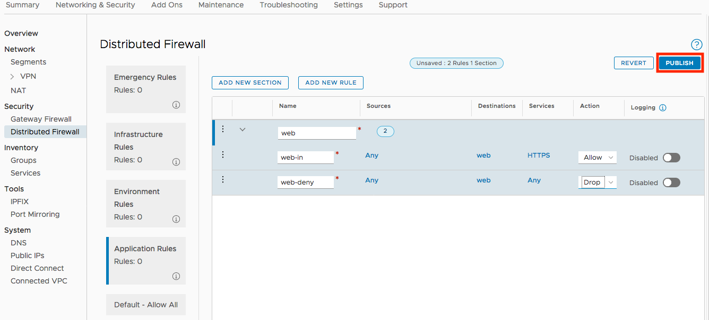
</figure>

Like the gateway firewalls, rules must be published before they are applied.
</section>

<section markdown="1" id="cross-linked-vpc">
## The Cross-Linked VPC
Since network security between the SDDC and the cross-linked customer VPC is managed in multiple places, it is worth specifically calling it out as a stand-along topic. Specifically, the security administrator must consider all of the points where security policy may be enforced for traffic between the SDDC and that VPC:
* DFW - Security policy defined by DFW would be enforced at the vNIC level of all VMs within the compute network.
* Gateway Firewall - Management Gateway policies would affect connectivity to/from the management network, and Compute Gateway policies would affect connectivity to/from the compute network.
* AWS Security Groups - The security groups of the VPC itself will impact connectivity to/from the VPC.

The policies of the gateway firewalls and DFW have already been discussed, so this section will focus on [Security Groups]({{ site.data.links.aws.vpc_secgroups.url }}) within the cross-linked VPC itself. As discussed in the chapter on SDDC network architecture, the cross-linking to the customer-owned VPC is enabled via a series of cross-account ENIs which are created within a subnet of that VPC for use by the hosts of the SDDC. As part of this setup, these ENIs are configured to utilize the default Security Group of the VPC. It is important to keep the following points in mind with Security Groups within the cross-linked VPC:

#### Direction
As mentioned, the cross-account ENIs used by the SDDC have the default Security Group applied to them. It is important to visualize this setup and remember that "inbound" rules of the Security Group apply to traffic from the VPC toward the SDDC, and that "outbound" rules apply to traffic from the SDDC toward the VPC.

#### Default Rules
By default, Security Groups are configured to permit all traffic outbound. Per the previous callout, this means that the SDDC can initiate connections to workloads within the VPC. Inbound, there is also a default rule which permits members of the same Security Group to communicate with each other. This means that any workloads which have the default Security Group applied to them may initiate connections to the SDDC.

#### Non-Default Security Groups
Often times, other services within the VPC are utilizing custom Security Groups. In these cases, the security administrator may need to modify both the customer Security Group as well as the default Security Group in order to ensure that the required connectivity is permitted.
</section>

<section markdown="1" id="nat">
## NAT
Network Address Translation (NAT) services are provided to the SDDC by the tier-0 edge. For outbound requests, by default, the workloads of the compute network will utilize a dedicated NAT IP which exists on the internet uplink of the tier-0 edge. This IP is visible from the Overview section of the Network & Security tab of the SDDC view in the VMC console.

<figure>
  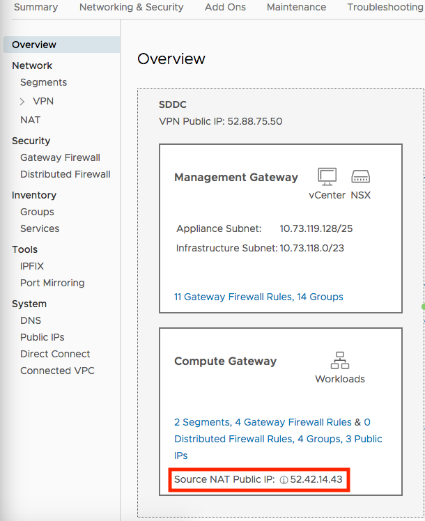
</figure>

Inbound NAT services are provided by first requesting a public EIP...

<figure>
  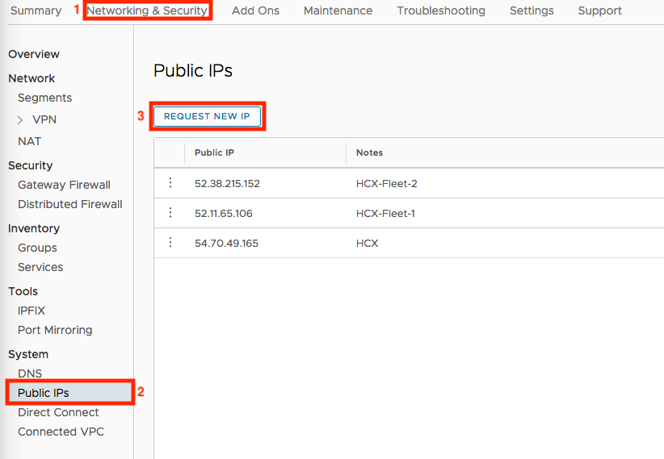
  <figcaption>Request a Public EIP</figcaption>
</figure>

...and then configuring NAT for that EIP.

<figure>
  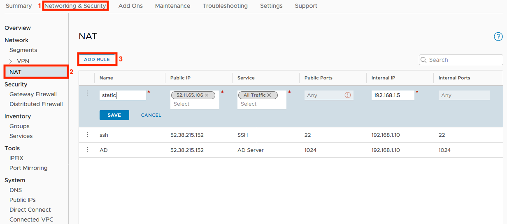
  <figcaption>Configure NAT</figcaption>
</figure>

In the example we can see that 2 inbound NAT rules have been configured which will NAT specific services from a public EIP to a real IP within the compute network. In this case, the real IP of both rules is the same but each rule could have also utilized different real IPs. Additionally, there is a new rule which is being created which will NAT all traffic from a particular public EIP to a real IP within the compute network. This new rule is effectively creating a *static NAT*.

Keep the following points in mind with NAT:
* Workloads within the compute network are permitted to NAT outbound by default.
* Outbound NAT utilizes a specific public EIP, which is used by all compute workloads by default.
* Inbound NAT requires that a dedicated public EIP be requested and that NAT rules be created for that EIP.
* Inbound NAT rules must be unique based on the combination of EIP and Service.
* If an inbound *static NAT* is configured, then the real IP which is the target for that NAT will utilize that same EIP for outbound NAT.
* Processing order for inbound NAT is as follows: NAT -> firewall -> routing. This means that since NAT is the first step in the pipeline that firewall rules must be written to reflect the real IP, not the public EIP.

</section>

<section markdown="1" id="recommendations">
## Recommendations
The following are some basic recommendations for working with network security within an SDDC.

#### Service Definitions
There are a great many pre-created service definitions within the SDDC. However, it sometimes makes sense to create custom definitions for custom applications. Consider creating a single service definition which encapsulates a given function of a custom application. For example, if an application utilizes a pair of TCP ports then define both ports as part of the service definition.

#### Using Groups
There are a few options available for group definitions (with additional new ones on the roadmap) within the SDDC. When creating groups, keep the following in mind:
* Anything which is external to a given network within the SDDC (management or compute) may only be referenced by IP. Utilize summary addresses as much as possible when defining IP-based groups.
* Anything native to a given network within the SDDC may be referenced by higher-level constructs such as VM name or security tag. Utilize the constructs as much as possible. Doing so will make your security policies more resilient if the need ever arises to change the IP of a VM.
* Security tags provide an excellent tool for defining security policy. Put some serious though into standardizing your tagging scheme. A common approach is to assume a "lego brick" model for tags: small, atomic tags which may be combined to effectively classify a workload. However, keep the maximum tags-per-VM limit in mind when designing your scheme.

#### Managing Sections
DFW utilizes sections as a means of organizing firewall rules. Consider organizing sections around your specific business requirements. For example, create a section per application or per business unit. Always remember that sections are only a means of organizing rules; rules are evaluated top-to-bottom independently of their parent section.

#### Porting Existing Rulesets
If your organization is like most, then you have accumulated years worth of "cruft" in your existing security policies. This tends to happen with IP-based rulesets. The rules quickly become complex, and security administrators are afraid to remove anything for fear of breaking something. 

Avoid the temptation to port existing rulesets to the SDDC. You have a unique opportunity to rework your policies based on higher-level grouping constructs which will very likely simplify your security policy. Don't miss this opportunity.
</section>
